# Architecture: Zero-Trust Hybrid Datacenter / Cloud

## 1. Hybrid Infrastructure Layout
The security architecture spans two major environments: the **On-Premises Private Datacenter** (segmented into distinct security subnets) and the **Public Cloud VPC** (hosting containerized modern microservices). These environments are connected securely via a simulated IPSec VPN tunnel.

```mermaid
graph TD
    subgraph On-Premises Datacenter [10.200.0.0/16]
        subgraph On-Prem DMZ Subnet [10.200.10.0/24]
            ZTNA_OnPrem[On-Prem ZTNA Gateway - 10.200.10.10]
        end
        subgraph On-Prem Workload Subnet [10.200.20.0/24]
            ExamApp[Examination Portal VM - 10.200.20.10]
            FacultyApp[Faculty Portal VM - 10.200.20.20]
        end
        subgraph On-Prem Database Subnet [10.200.30.0/24]
            ExamDB[(Examination DB - 10.200.30.10)]
            FacultyDB[(Faculty DB - 10.200.30.20)]
        end
        subgraph On-Prem Management Subnet [10.200.40.0/24]
            OnPremMgmt[Admin Jump Box - 10.200.40.10]
            DNS_Resolver[Local DNS Resolver - 10.200.40.5]
        end
        subgraph On-Prem Security/Logging Subnet [10.200.50.0/24]
            OnPremSIEM[Syslog Collector - 10.200.50.100]
        end
        OnPremGW[VPN Gateway - 10.200.254.254]
    end

    subgraph Public Cloud VPC [10.100.0.0/16]
        direction TB
        subgraph Cloud Public Subnet [10.100.1.0/24]
            ZTNA_Cloud[Cloud ZTNA Gateway - 10.100.1.10]
        end
        subgraph Cloud Private Subnet [10.100.2.0/23]
            subgraph Kubernetes Cluster
                subgraph kube-system
                    DNS[CoreDNS - 10.96.0.10]
                end
                subgraph student-portal Namespace
                    StudentPod[Student Portal Pod]
                    StudentDB[(Student DB Pod)]
                end
                subgraph research-app Namespace
                    ResearchPod[Research App Pod]
                    ResearchDB[(Research DB Pod)]
                end
            end
        end
        CloudGW[Cloud VPN Gateway - 10.100.254.254]
    end

    subgraph Secure Management VPC [172.16.0.0/16]
        subgraph Mgmt Subnet [172.16.1.0/24]
            SIEM[SIEM / SOC Syslog Receiver - 172.16.1.100]
        end
    end

    %% Network Connections
    OnPremGW <==> |IPSec VPN Tunnel| CloudGW
    ZTNA_Cloud -.-> |Proxy: HTTP/8080| StudentPod
    ZTNA_Cloud -.-> |Proxy: HTTP/8080| ResearchPod
    ZTNA_OnPrem -.-> |Proxy: HTTP/8080| FacultyApp
    ZTNA_OnPrem -.-> |Proxy: HTTPS/8443| ExamApp

    %% Syslog streams
    StudentPod -.-> |Syslog-TLS/514| SIEM
    ResearchPod -.-> |Syslog-TLS/514| SIEM
    FacultyApp -.-> |Syslog-TLS/514| SIEM
    ExamApp -.-> |Syslog-TLS/514| SIEM
    ZTNA_Cloud -.-> |Syslog-TLS/514| SIEM
    ZTNA_OnPrem -.-> |Syslog-TLS/514| SIEM
    OnPremGW -.-> |Syslog| SIEM
    CloudGW -.-> |Syslog| SIEM
```

---

## 2. On-Premises Datacenter Subnet Segmentation (Remediated CRIT-03)
* **IP Space**: `10.200.0.0/16`
* **Infrastructure**: Standard virtualized environments.
* **Subnets**:
  1. **On-Prem DMZ Subnet (`10.200.10.0/24`)**: Isolates the On-Premises ZTNA Gateway (`10.200.10.10`).
  2. **On-Prem Workload Subnet (`10.200.20.0/24`)**: Houses application VM instances.
     - **Examination Portal VM** (`10.200.20.10`)
     - **Faculty Portal VM** (`10.200.20.20`)
  3. **On-Prem Database Subnet (`10.200.30.0/24`)**: Hosts database servers.
     - **Examination DB VM** (`10.200.30.10`)
     - **Faculty DB VM** (`10.200.30.20`)
  4. **On-Prem Management Subnet (`10.200.40.0/24`)**: Hosts infrastructure nodes.
     - **Admin Jump Box** (`10.200.40.10`)
     - **Local DNS Resolver** (`10.200.40.5`)
  5. **On-Prem Security/Logging Subnet (`10.200.50.0/24`)**: Hosts the Syslog Collector (`10.200.50.100`).
* **Security Controls**: An edge firewall routes traffic between subnets. Inter-subnet traffic defaults to deny. Host-level iptables rules are active on database VMs, admitting connections only from designated workload VMs.

---

## 3. Public Cloud Environment (Simulated)
* **IP Space**: `10.100.0.0/16`
* **VPC Subnets**:
  * **Public Subnet (`10.100.1.0/24`)**: Hosts the **Cloud ZTNA Gateway** (`10.100.1.10`), which proxies traffic for Student and Research portals.
  * **Private Subnet (`10.100.2.0/23`)**: Hosts the managed Kubernetes cluster. Workloads have private IPs only.
* **Kubernetes Security Boundary**:
  * **Namespaces**: Isolates microservices (`student-portal`, `research-app`, `kube-system`).
  * **NetworkPolicies**: Restricts namespace traffic. Inbound is allowed *only* from the Cloud ZTNA Gateway IP on port 8080. Egress is restricted *only* to CoreDNS (`10.96.0.10:53`) and the respective database pod in the same namespace, or the Central SIEM endpoint on port 514.

---

## 4. Secure Hybrid Connectivity & VPN Routing
The On-Premises Datacenter and Public Cloud VPC are linked by a **Virtual Private Network (VPN) Gateway** pair.
* **Protocol**: IPSec IKEv2 with AES-256 encryption.
* **Traffic Control**: VPN routing tables restrict traffic. Under no circumstances can a pod in the Cloud private subnet initiate a raw TCP connection directly to an On-Premises database VM or workload VM. Traffic from the Cloud VPC is limited to sending syslog telemetry to the central SIEM.

---

## 5. ZTNA Access Gateway Architecture (Remediated CRIT-04)
To avoid a single-point-of-compromise vulnerability:
1. **Split-Gateways**: We run two logically and physically isolated gateways:
   - **Cloud ZTNA Gateway (`10.100.1.10`)** is authorized to route *only* to cloud workloads (`Student Portal`, `Research App`).
   - **On-Prem ZTNA Gateway (`10.200.10.10`)** is authorized to route *only* to datacenter workloads (`Faculty Portal`, `Examination System`).
2. **Identity Verification & Session Token Routing**:
   - The gateways terminate HTTPS sessions, authenticate users, enforce MFA, and check authorization policies.
   - Upon successful verification, the gateways forward traffic with a cryptographically signed header token. Workloads validate this token before processing requests, preventing unauthorized lateral movement if a gateway is compromised.
3. **No Database Access**: Gateway routing tables and firewalls prohibit direct connection to database zones.
