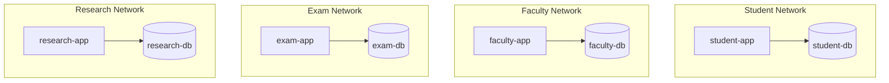

# Container Architecture and Development Isolation

> [!IMPORTANT]
> **Phase 2 Development Isolation Warning**
> The Docker network isolation configured in this phase is a local representation of security boundaries for development. It is **NOT** equivalent to the final production-grade VPC routing rules, cloud Security Groups, or Kubernetes namespace `NetworkPolicies`. It serves to validate that workloads do not require lateral access to other dependencies at an application level.

---

## 1. Container Topology

The local development environment consists of 8 container workloads grouped into 4 distinct application-database logical pairs:

### Workload Services & Ports

| Service Name | Port (Internal) | Port (Host Exposed) | Database Dependency | Network |
|---|---|---|---|---|
| `student-app` | `8081` | `8081` | `student-db` (5432) | `student-net` |
| `student-db` | `5432` | None | None | `student-net` |
| `faculty-app` | `8082` | `8082` | `faculty-db` (3306) | `faculty-net` |
| `faculty-db` | `3306` | None | None | `faculty-net` |
| `exam-app` | `8083` | `8083` | `exam-db` (1521) | `exam-net` |
| `exam-db` | `1521` | None | None | `exam-net` |
| `research-app` | `8084` | `8084` | `research-db` (5432) | `research-net` |
| `research-db` | `5432` | None | None | `research-net` |

---

## 2. Network Topology & Microsegmentation

To model zero-trust segregation locally, we configure **four separate user-defined bridge networks** inside `docker-compose.yml`:
1. `student-net`
2. `faculty-net`
3. `exam-net`
4. `research-net`

Each application container is only attached to its respective network. The security boundaries are enforced as follows:
- **IP Network Connectivity (Bridge Isolation)**: Each user-defined network is instantiated as a distinct logical Linux bridge interface on the host with its own IP subnet. By default, Docker does not configure IP routing (iptables rules) to forward packets between different user-defined bridge networks. Therefore, containers on different networks cannot communicate via raw IP addresses.
- **DNS Name Resolution**: Docker's embedded DNS server resolves hostnames (e.g., `student-db`) only for containers attached to the same network.
- **DNS vs. Routing**: DNS resolution failure is a *consequence* of this network-level isolation, not the primary security mechanism. DNS resolution failure alone is **NOT** considered proof of network isolation. Even if an attacker obtained the raw IP address of a container on another network, the connection would be blocked at the IP layer because no routing path exists between the bridges.

---

## 3. Communication Matrix (Allowed / Blocked)

### Traffic Authorization Table

| Source Workload | Target Workload | Policy | Enforcement Mechanism |
|---|---|---|---|
| `student-app` | `student-db` | **ALLOW** | Network membership (`student-net`) |
| `student-app` | `faculty-db` | **BLOCK** | Bridge network IP isolation (No routing path) |
| `student-app` | `exam-db` | **BLOCK** | Bridge network IP isolation (No routing path) |
| `student-app` | `research-db` | **BLOCK** | Bridge network IP isolation (No routing path) |
| `faculty-app` | `faculty-db` | **ALLOW** | Network membership (`faculty-net`) |
| `faculty-app` | `student-db` | **BLOCK** | Bridge network IP isolation (No routing path) |
| `faculty-app` | `exam-db` | **BLOCK** | Bridge network IP isolation (No routing path) |
| `faculty-app` | `research-db` | **BLOCK** | Bridge network IP isolation (No routing path) |
| `exam-app` | `exam-db` | **ALLOW** | Network membership (`exam-net`) |
| `exam-app` | `student-db` | **BLOCK** | Bridge network IP isolation (No routing path) |
| `exam-app` | `faculty-db` | **BLOCK** | Bridge network IP isolation (No routing path) |
| `exam-app` | `research-db` | **BLOCK** | Bridge network IP isolation (No routing path) |
| `research-app` | `research-db` | **ALLOW** | Network membership (`research-net`) |
| `research-app` | `student-db` | **BLOCK** | Bridge network IP isolation (No routing path) |
| `research-app` | `faculty-db` | **BLOCK** | Bridge network IP isolation (No routing path) |
| `research-app` | `exam-db` | **BLOCK** | Bridge network IP isolation (No routing path) |

---

## 4. Local Environment Security Controls

- **No Host Database Exposure**: Database service ports are not exposed to the host machine. This prevents external access and brute-force scans on database listeners.
- **Environment Secret Injection**: Database credentials (e.g. `STUDENT_DB_PASSWORD`) are injected dynamically from a local `.env` file, which is excluded from git version control.
- **Non-Root Containers**: Portals run under the standard unprivileged `node` user context inside the containers.

---

## 5. Kubernetes & Cloud Production Mapping

When transitioning from local containers to cloud infrastructure, the local controls map directly to enterprise-grade security abstractions:

| Local Docker Control | Target Kubernetes Abstraction | Cloud Production Equivalence |
|---|---|---|
| Isolated bridge network | Dedicated namespace isolation | VPC subnetting & CIDR division |
| Docker DNS restriction | Kubernetes DNS & namespace rules | VPC routing tables & NACLs |
| Network segmentation | `NetworkPolicy` ingress/egress rules | VPC Security Groups & Firewalls |
| Local `.env` secrets | Kubernetes `Secret` resources | HashiCorp Vault or Cloud KMS |
| Alpine non-root image | Pod Security Standards (`restricted`) | IAM Role Workload Identity |
