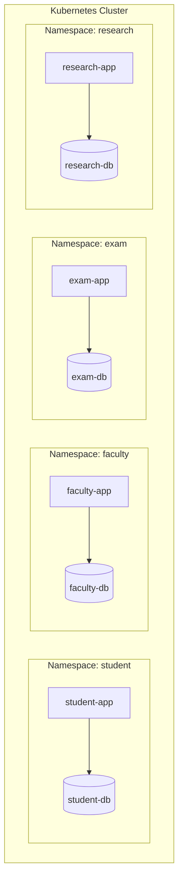

# Kubernetes Environment Architecture

This document describes the foundation architecture of the SecureHaven local Kubernetes security lab.

---

## 1. Selected Kubernetes Distribution

### Choice: `kind` (Kubernetes in Docker) or `k3d` (K3s in Docker)

- **Selection**: `kind` is selected as the primary recommended local distribution.
- **Rationale**:
  - **Lightweight footprint**: Runs entirely as Docker containers on a single developer machine.
  - **No VM Overhead**: Unlike Minikube (which default-deploys a hypervisor VM), `kind` maps directly to the host's Docker engine.
  - **Local Image Loading**: Supports loading locally built images directly (`kind load docker-image <image>`) without pushing them to a public registry.
  - **High Reproducibility**: Cluster configurations are declarable in simple YAML definitions.

---

## 2. Namespace & Workload Segmentation

To isolate the blast-radius of compromises, each application-database pair is placed in its own dedicated Kubernetes **Namespace**:

### Namespace Inventory

1. `student`: Enclosing the Student Portal and its PostgreSQL database.
2. `faculty`: Enclosing the Faculty Portal and its MariaDB database.
3. `exam`: Enclosing the Examination Portal and its custom-port PostgreSQL database.
4. `research`: Enclosing the Research Portal and its PostgreSQL database.

---

## 3. Workload & Service Architecture

### Pod Specifications

- **Non-Root Execution**:
  - Portal workloads are configured with `runAsNonRoot: true` and `runAsUser: 1000`, running under the unprivileged `node` user context.
  - Database workloads are configured to run as their standard non-root service IDs (UID `999` for postgres and mariadb).
- **Probes**:
  - Readiness and Liveness probes check `/health` (HTTP Get) for web applications.
  - Exec probes (`pg_isready` and `mariadb-admin ping`) check database processes locally.
- **Resource Constraints**: All containers specify explicit CPU and memory `requests` and `limits` to prevent resource exhaustion attacks (DoS).

### Service Specifications

- All database and application services are instantiated as **`ClusterIP`** services.
- Database service ports are strictly internal to the cluster.
- No services use `NodePort`, `LoadBalancer`, or public external IPs. This ensures databases are unreachable from the outside host network.

---

## 4. Secret Management Approach

- **Local Development**: Database passwords are stored inside Kubernetes `Secret` resources in each namespace. Workload deployments reference these secrets using the `secretKeyRef` syntax, injecting them as container environment variables (`DB_PASSWORD`).
- **Production Warning**:
  > [!WARNING]
  > Standard Kubernetes Secret values are only Base64-encoded, not encrypted. In production environments, additional hardening is mandatory:
  > 1. Enable **KMS encryption at rest** in the cloud Kubernetes API server.
  > 2. Use external vault integrations (e.g. HashiCorp Vault, AWS Secrets Manager) via CSI drivers.
  > 3. Use GitOps secret management tools (e.g. Bitnami SealedSecrets or Mozilla SOPS) to avoid committing raw secret values to version control.

---

## 5. Planned NetworkPolicy Model (Phase 3D/3E)

While NetworkPolicies are not applied in this initial foundation phase, the final zone enforcement will adhere to a **default-deny** policy:

1. **Default Deny Ingress/Egress**: All namespaces will implement a wildcard block on incoming and outgoing network traffic.
2. **Explicit Allow**:
   - `student-app` is allowed egress only to `student-db:5432` within the `student` namespace.
   - `student-db` is allowed ingress only from `student-app` within the `student` namespace.
   - All cross-namespace traffic between applications or databases is blocked.

---

## 6. Runtime Limitations

- **No Local Docker/Kubernetes Engine**: The development environment lacks a running Docker daemon or Kubernetes CLI (`kubectl`/`kind`). Manifests are statically audited via `manifest_validator.js` to confirm syntax and configuration correctness, but live pod execution has not been verified.
