# Network Design: Zero-Trust Segments and Hybrid Connectivity

## 1. Zero-Trust Network Topology
To enforce micro-segmentation, the hybrid network is split into strict security zones. Communication between these zones is denied by default and allowed only through explicitly configured firewall policies, VPC security groups, and Kubernetes NetworkPolicies.

```mermaid
graph TD
    subgraph Public Internet
        User[Authenticated User]
    end

    subgraph Public Cloud VPC [10.100.0.0/16]
        subgraph Cloud DMZ Subnet [10.100.1.0/24]
            ZTNA_Cloud[Cloud ZTNA Gateway - 10.100.1.10]
        end
        
        subgraph Cloud Private Subnet [10.100.2.0/23]
            subgraph Kubernetes Cluster
                subgraph kube-system namespace
                    DNS[CoreDNS Service - 10.96.0.10]
                end
                subgraph student-portal namespace
                    StudentPod[Student Portal Pod]
                    StudentDB[(Student DB Pod)]
                end
                subgraph research-app namespace
                    ResearchPod[Research App Pod]
                    ResearchDB[(Research DB Pod)]
                end
            end
        end
        CloudGW[Cloud VPN Gateway - 10.100.254.254]
    end

    subgraph On-Premises Datacenter [10.200.0.0/16]
        subgraph On-Prem DMZ Subnet [10.200.10.0/24]
            ZTNA_OnPrem[On-Prem ZTNA Gateway - 10.200.10.10]
        end
        subgraph On-Prem Workload Subnet [10.200.20.0/24]
            FacultyApp[Faculty Portal VM - 10.200.20.20]
            ExamApp[Examination Portal VM - 10.200.20.10]
        end
        subgraph On-Prem Database Subnet [10.200.30.0/24]
            FacultyDB[(Faculty DB VM - 10.200.30.20)]
            ExamDB[(Examination DB VM - 10.200.30.10)]
        end
        subgraph On-Prem Management Subnet [10.200.40.0/24]
            OnPremMgmt[Admin Jump Box - 10.200.40.10]
        end
        subgraph On-Prem Security/Logging Subnet [10.200.50.0/24]
            OnPremSIEM[Syslog Collector - 10.200.50.100]
        end
        OnPremGW[On-Prem VPN Gateway - 10.200.254.254]
    end

    subgraph Secure Management VPC [172.16.0.0/16]
        subgraph Mgmt Subnet [172.16.1.0/24]
            SIEM[Central SIEM / SOC Receiver - 172.16.1.100]
        end
    end

    %% Network Connectivity
    User -.-> |HTTPS/443| ZTNA_Cloud
    User -.-> |HTTPS/443| ZTNA_OnPrem
    ZTNA_Cloud --> |Proxy: HTTP/8080| StudentPod
    ZTNA_Cloud --> |Proxy: HTTP/8080| ResearchPod
    ZTNA_OnPrem --> |Proxy: HTTP/8080| FacultyApp
    ZTNA_OnPrem --> |Proxy: HTTPS/8443| ExamApp
    
    OnPremGW <==> |IPSec VPN Tunnel| CloudGW
    OnPremGW <==> |IPSec VPN Tunnel| SIEM
```

---

## 2. On-Premises Network Subnets (Remediated CRIT-03)
The flat `/16` network has been segmented into five distinct security zones (subnets) behind a central firewall/router. Inter-subnet traffic is blocked by default.

1. **On-Prem DMZ Subnet (`10.200.10.0/24`)**: Houses the On-Premises ZTNA Gateway. This is the only zone exposed to inbound external connections from approved users.
2. **On-Prem Workload Subnet (`10.200.20.0/24`)**: Houses application servers. 
   - `10.200.20.10` - Examination System VM
   - `10.200.20.20` - Faculty Portal VM
3. **On-Prem Database Subnet (`10.200.30.0/24`)**: Houses backend databases. No direct access from the DMZ or VPN is permitted.
   - `10.200.30.10` - Examination Database VM
   - `10.200.30.20` - Faculty Database VM
4. **On-Prem Management Subnet (`10.200.40.0/24`)**: Contains the secure admin jump boxes (`10.200.40.10`).
5. **On-Prem Security/Logging Subnet (`10.200.50.0/24`)**: Houses the local Syslog Collector (`10.200.50.100`) which forwards encrypted audit logs to the central SIEM.

---

## 3. ZTNA Gateway Ingress and Communication Paths (Remediated CRIT-02)
To prevent the ZTNA Gateways from serving as open bridges across the entire network, ingress routing is strictly restricted at the network and CNI layer.

### Allowed Ingress Matrix

| Source | Destination | Target Port | Policy | Reason |
|---|---|---|---|---|
| **ZTNA Cloud Gateway** | Student Portal Pod | TCP / 8080 | **ALLOW** | Authorized proxying of student web requests. |
| **ZTNA Cloud Gateway** | Research App Pod | TCP / 8080 | **ALLOW** | Authorized proxying of research portal requests. |
| **ZTNA Cloud Gateway** | Student DB Pod | TCP / 5432 | **DENY** | Direct database access is strictly prohibited. |
| **ZTNA Cloud Gateway** | Kubernetes API | TCP / 6443 | **DENY** | Prevent control-plane queries from the DMZ. |
| **ZTNA On-Prem Gateway** | Faculty Portal VM | TCP / 8080 | **ALLOW** | Proxying authorized faculty connections. |
| **ZTNA On-Prem Gateway** | Examination VM | TCP / 8443 | **ALLOW** | Proxying authorized exam administrators. |
| **ZTNA On-Prem Gateway** | Faculty DB VM | TCP / 3306 | **DENY** | Gateways must not access databases directly. |
| **ZTNA On-Prem Gateway** | Examination DB VM | TCP / 1521 | **DENY** | Gateways must not access databases directly. |
| **ZTNA On-Prem/Cloud** | Management Subnets | Any | **DENY** | Gateways are prohibited from accessing management nodes. |

---

## 4. DNS Security and Egress Control (Remediated CRIT-01)

### DNS Architecture
Applications must use the internal cluster DNS resolver (**CoreDNS** at `10.96.0.10` inside the cluster, or an approved Local Bind Resolver at `10.200.40.5` on-premises) for name resolution. Under no circumstances are workloads allowed to send DNS queries to arbitrary external DNS resolvers (e.g., Google DNS at `8.8.8.8` or Cloudflare DNS at `1.1.1.1`). This mitigation addresses DNS hijacking, DNS cache poisoning, and DNS exfiltration attacks.

### DNS Enforcement Rules
1. **Kubernetes Egress Limits**:
   - The NetworkPolicy applied to application pods (like the `research-app`) explicitly restricts UDP/TCP port 53 egress to the IP block of the `kube-dns` service (`10.96.0.10/32`) in the `kube-system` namespace.
   - Any packet destined for port 53 outside of the `kube-dns` CIDR is dropped at the CNI layer.
2. **On-Premises Firewall Limits**:
   - Outbound DNS (UDP/TCP 53) from the application subnet (`10.200.20.0/24`) is blocked to the public internet.
   - Workloads must route queries to the local internal resolver (`10.200.40.5`).

### Operational Impact of DNS Failures
- **Behavior under DNS Outage**: If the internal resolver goes offline, workloads will fail to resolve internal database hostnames (e.g., `research-db.research-app.svc.cluster.local`). The application will throw lookup errors and halt startup, containing the failure within the application boundary. It will **not** fail-open or route queries to external public DNS servers.

### DNS Auditing & Monitoring
- CoreDNS query logging is enabled. All DNS lookup requests are forwarded via syslog to the SIEM.
- The SIEM runs real-time detection rules to flag:
  - **High-frequency requests** to lookups with random string prefixes (a signature of DNS tunneling).
  - **Egress failures** logged by the CNI/Firewall where a pod attempted to query an external DNS resolver.
