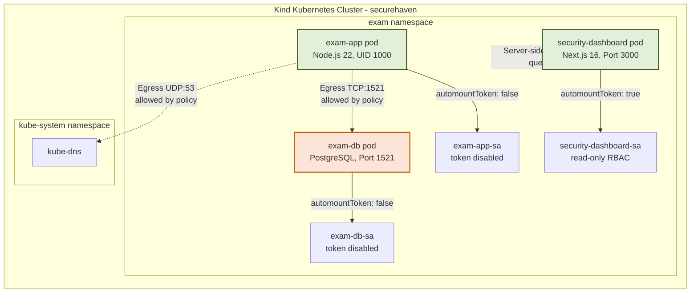

# SecureHaven — Project Report

## Kubernetes Security Hardening & Zero-Trust Security Monitoring Dashboard

**B.Tech CSE Final Year Project**
**Cisco Virtual Internship 2026 — Cyber Security**
**LNCTS, Bhopal**

**Author:** Krishna Mohan
**Project Guide:** Academic Department of Computer Science & Engineering

---

## Abstract

This project, SecureHaven, is focused on building a secure Kubernetes environment for a college exam portal using Zero-Trust security principles. I set up a multi-node Kubernetes cluster using Kind and isolated the sensitive exam workloads inside a dedicated namespace. To enforce strong security, I configured Calico network policies to block all traffic by default, only allowing essential communication between the web app and the database. I also hardened the containers by making sure they do not run as root, dropping all administrative Linux capabilities, and locking the container filesystem to read-only. For monitoring, I built a Next.js dashboard that securely checks the cluster status from the server side, keeping cluster tokens safe from browser-side exposure. The system was validated using custom test scripts, scoring 96 out of 100 on security benchmarks and passing all 13 runtime verification tests.

**Keywords:** Kubernetes, Zero-Trust, Container Security, NetworkPolicy, RBAC, Microsegmentation, Security Dashboard, Next.js, Docker, Calico CNI, Cybersecurity Engineering

---

## Table of Contents

* **Chapter 1 — Introduction**
  * 1.1 Project Overview
  * 1.2 The Core Problem
  * 1.3 Why This Project Matters
  * 1.4 Main Objectives
  * 1.5 What is Covered (Scope)
  * 1.6 Cisco Internship Context & Case Study
* **Chapter 2 — Existing System and Problem Analysis**
  * 2.1 Standard Kubernetes Configurations
  * 2.2 Why Default Settings are Risky
  * 2.3 Attack Scenario and Blast-Radius Threat Model
* **Chapter 3 — Proposed System**
  * 3.1 Introducing SecureHaven
  * 3.2 Key Features
  * 3.3 What Makes This Project Unique
* **Chapter 4 — Requirement Analysis**
  * 4.1 What the System Must Do (Functional Requirements)
  * 4.2 How the System Should Perform (Non-Functional Requirements)
  * 4.3 Security Rules
  * 4.4 Hardware and Software Used
* **Chapter 5 — System Architecture**
  * 5.1 High-Level Architecture
  * 5.2 Kubernetes Setup Details
  * 5.3 Network Traffic Access List
* **Chapter 6 — Technology Stack**
* **Chapter 7 — Security Design and Implementation**
  * 7.1 Hardening the Containers
  * 7.2 Read-Only Filesystem Setup
  * 7.3 Calico Network Policies
  * 7.4 RBAC Roles and ServiceAccounts
  * 7.5 Managing Secrets
  * 7.6 Setting Resource Limits
  * 7.7 Container Image Decisions
  * 7.8 Dashboard Security Design
* **Chapter 8 — Dashboard Implementation**
  * 8.1 Dashboard Layout
  * 8.2 Frontend Components
  * 8.3 Theme Flickering Fix (FOUC)
* **Chapter 9 — Testing and Verification**
  * 9.1 How I Tested the Project
  * 9.2 Real-world Verification Results
  * 9.3 Custom Automated Test Scripts
* **Chapter 10 — Results and Discussion**
  * 10.1 Score Breakdown
  * 10.2 Technical Observations
* **Chapter 11 — Cisco Security Technology Mapping**
* **Chapter 12 — Teams and Secure Deployment Steps**
  * 12.1 Engineering Roles
  * 12.2 Deployment Workflow
* **Chapter 13 — Current Limitations**
* **Chapter 14 — Future Work**
* **Chapter 15 — Conclusion**
* **Chapter 16 — My Contributions & Technical Challenges Solved**
  * 16.1 What I Worked On
  * 16.2 Major Bugs I Faced and How I Fixed Them
* **Chapter 17 — Real-World Use Cases**
* **References**
* **Appendices**
  * **Appendix A** — Key Configuration Manifests
  * **Appendix B** — Testing Commands Used
  * **Appendix C** — Code Folder Map and GitHub Repository Links
  * **Appendix D** — Full 80 Test Case Logs

---

## Chapter 1 — Introduction

### 1.1 Project Overview

These days, organizations are moving away from running applications on single large servers. Instead, they package applications into small, independent parts called containers and run them using Kubernetes. This approach makes it easy to scale systems up or down, but it also introduces new security risks. 

In the old days, companies relied on perimeter firewalls to protect their networks. If a hacker got past the firewall, they had access to everything inside the network. This project focuses on applying the "Zero-Trust" model ("Never Trust, Always Verify") directly inside a Kubernetes cluster, making sure that every service is isolated and secured.

### 1.2 The Core Problem

By default, Kubernetes is designed to be highly cooperative rather than secure:
* Containers run as the administrator (root user) by default. If a hacker exploits a bug in the app, they can take control of the entire host server.
* Any container inside the cluster can talk to any other container across namespaces.
* Applications are automatically given service tokens that let them talk to the Kubernetes API, which could allow a hacker to gain admin rights.
* If filesystems are left writable, hackers can download and run malicious scripts easily.
* If we do not restrict CPU and memory usage, a single compromised container can hog all the resources, crashing other critical services.

### 1.3 Why This Project Matters

I built this project during my **Cisco Virtual Internship 2026 — Cyber Security**. The goal was to design a secure network architecture for a college. 

Colleges have many different systems: public-facing websites, student portals, research systems, and examination databases. The research system is usually open and collaborative, which makes it a likely target for attacks. The objective of SecureHaven is to build a setup where even if a public application gets compromised, the high-security exam database remains protected and isolated.

### 1.4 Main Objectives

* **Workload Isolation:** Make sure containers run as non-root users and drop unnecessary capabilities.
* **Filesystem Lockdown:** Lock down the container filesystems to read-only, allowing write access only to `/tmp`.
* **Network Segmentation:** Enforce default-deny network rules and only whitelist necessary communication paths.
* **Access Control:** Disable automatic service account tokens and use read-only roles for monitoring.
* **Secure Configurations:** Stop hardcoding passwords and use Kubernetes Secrets to inject credentials at runtime.
* **Resource Limits:** Configure quotas to prevent single containers from exhausting the cluster's resources.
* **Security Dashboard:** Create a Next.js dashboard that safely queries the cluster status from the server side without exposing access credentials.
* **Testing:** Create validation scripts to confirm our security settings work under real attacks.

### 1.5 What is Covered (Scope)

This project focuses on securing the `exam` namespace in a local multi-node Kind cluster. I set up and hardened three main components:
1. `exam-app`: The Node.js application server.
2. `exam-db`: The PostgreSQL database server.
3. `security-dashboard`: The Next.js dashboard used to monitor security metrics.

Other college services (student, faculty, and research namespaces) are kept in their default, unhardened state to demonstrate the differences in security posture.

### 1.6 Cisco Internship Context & Student Problem Statement

This project is directly designed around the official Cisco Virtual Internship 2026 Student Problem Statement for Cyber Security:

> "Many applications are hosted in the enterprise datacenter as well as public cloud today. Most applications and "workloads" are hybrid - meaning that the application uses services in both the private data center and public cloud. Since data has to exit the private data center to reach the public cloud, there must be strong network security and segmentation. The cloud security functionality (such as aws' security groups and IAM) form a significant factor in providing this security.
> 
> Modern applications also use kubernetes orchestrated containers and microservices to provide highly scalable, cloud native services. These kubernetes orchestrated applications can be present in both private data centers using technology such as openshift or in public cloud using GKE, EKS or AKE.
> 
> When a new application has to be deployed, multiple stakeholders are now needed - application developers, network designers, kubernetes platform engineers, etc.
> 
> Faculty members also now work flexibly from home or campus, and require uninterrupted, secure access to teaching tools, research repositories, and internal services to applications that are running in hybrid mode - private datacenter services connected to services in the public cloud.
> 
> Your task is to design a secure hybrid datacenter network architecture that supports applications connecting or using services between private datacenter and public cloud. How should IAM function? What kind of security groups must be utilized? How can applications be segmented in VPCs such that we can mitigate any attack on a single application from spreading into other applications, VPCs or into the enterprise network itself.
> 
> Can your design balance simplicity, security, and scale without overwhelming the existing infrastructure?"

To address this prompt, the project maps a college network environment into five logical sub-networks or VPCs:
* **VPC-A (Student Portal):** General web interfaces with standard load balancers.
* **VPC-B (Faculty Portal):** Secure interfaces for teaching staff.
* **VPC-C (Examination System):** The critical system containing exam papers. **This is what I secured in SecureHaven.**
* **VPC-D (Research Application):** Collaborative apps with high-risk exposure.
* **Shared Services VPC:** Standard services like DNS and monitoring.

---

## Chapter 2 — Existing System and Problem Analysis

### 2.1 Standard Kubernetes Configurations

In a default Kubernetes setup:
* Apps run as the root user.
* All filesystems are writable.
* Pods automatically receive administrative API tokens.
* Any container can reach any other container across namespaces.

### 2.2 Why Default Settings are Risky

| Defect | Exploit Path | Business Impact |
|:---|:---|:---|
| Root Container Process | Exploiting an application bug gives root access on the host server. | Complete host takeover; access to other containers on the node. |
| Writable Root Filesystem | Attackers download tools (like curl or nmap) to scan networks. | Long-term backdoors; data extraction. |
| Auto-mounted default SA Token | Stolen tokens are used to request admin commands from the cluster API. | Service account hijacking; unauthorized cluster control. |
| Flat Pod Network | Lateral scanning lets hackers locate and query databases. | Data theft from neighboring applications. |
| No Resource Limits | Compromised container is used for cryptomining or gets flooded with requests. | Host exhaustion; denial of service for all applications on the host. |
| Hardcoded Credentials | Database credentials are checked into Git repositories in cleartext. | Credential exposure to unauthorized developers or public leaks. |

### 2.3 Attack Scenario and Blast-Radius Threat Model

Based on the Cisco case study, I evaluated this attack path:
1. **Initial Access:** A hacker steals a faculty login or exploits a public application (like the Research App).
2. **Workload Takeover:** The hacker gains shell access inside the Research container.
3. **Lateral Expansion:** The hacker scans the internal network to find other systems.
4. **Privilege Escalation:** The hacker attempts to query the Kubernetes API to gather tokens or secrets.
5. **Target Compromise:** The hacker finds the Exam Database and steals exam papers.

**Core Principle:** A compromised app must not mean a compromised enterprise. I configured the cluster so that a breach in the Research namespace cannot spread to the Exam namespace.

---

## Chapter 3 — Proposed System

### 3.1 Introducing SecureHaven

SecureHaven is my proposed solution. It consists of a hardened Kubernetes cluster deployment and a Next.js security monitoring dashboard. It addresses the issues identified in Chapter 2, showing that we can run containerized apps securely without losing observability.

### 3.2 Key Features

* **Non-root Containers:** All workloads run as UID 1000 with dropped capabilities.
* **Read-only Filesystems:** Application filesystems are read-only, preventing malicious writes.
* **Network Microsegmentation:** Calico policies enforce a default-deny rule, allowing only whitelisted flows.
* **Token Hardening:** Workload ServiceAccounts have token auto-mounting turned off.
* **Secure Telemetry API:** The Next.js dashboard fetches cluster status from the server side, keeping credentials safe.
* **Resource Limits:** Namespace quotas prevent resource exhaustion attacks.

### 3.3 What Makes This Project Unique

* **Active Security Dashboard:** Instead of just setting up rules, I built a visual interface that queries the cluster status and shows active configurations.
* **Server-side Telemetry Processing:** The dashboard queries APIs server-side. It removes internal IP addresses, environment variables, and tokens before sending data to the client, preventing credential leaks.
* **Automated Isolation Testing:** I wrote a 4x4 network connection matrix test script that probes network paths between containers to verify traffic restrictions.

---

## Chapter 4 — Requirement Analysis

### 4.1 What the System Must Do (Functional Requirements)

* **FR-1:** `exam-app` must expose a `/health` endpoint indicating database connection status.
* **FR-2:** `exam-app` must connect to `exam-db` on the custom port `1521`.
* **FR-3:** The dashboard must run a server-side route `/api/security-status` to query cluster configuration.
* **FR-4:** The UI must display a clear security rating score and a list of active security checks.
* **FR-5:** The UI must show resource quota usage stats.
* **FR-6:** The dashboard must display verification test output logs.

### 4.2 How the System Should Perform (Non-Functional Requirements)

* **NFR-1 (Speed):** The dashboard must load and display metrics within 3 seconds.
* **NFR-2 (Responsiveness):** The interface must look clean on all standard screen sizes (desktop and mobile).
* **NFR-3 (Theme Sync):** Theme preferences (dark/light) must persist across page loads without visual flickering.
* **NFR-4 (Robustness):** If the cluster is down, the dashboard must fail gracefully and show fallback mock metrics.

---

## Chapter 5 — System Architecture

### 5.1 High-Level Architecture

Here is how the SecureHaven services communicate:



### 5.2 Kubernetes Setup Details

* **Namespaces:** I used the `exam` namespace to isolate our application.
* **ServiceAccounts:**
  * `exam-app-sa`: Assigned to the exam-app pod (no API permissions, token disabled).
  * `exam-db-sa`: Assigned to the database pod (no API permissions, token disabled).
  * `security-dashboard-sa`: Assigned to the dashboard pod, granting access to read-only resource information.
* **RBAC Role & Binding:** A `Role` named `security-dashboard-role` restricts dashboard API access to `get` and `list` operations for pods, services, deployments, network policies, resource quotas, limit ranges, and service accounts. A `RoleBinding` links this Role to the dashboard ServiceAccount.
* **NetworkPolicies:** Enforce traffic rules. The default policy blocks all ingress and egress. Explicit rules allow communication from `exam-app` to `exam-db` on port 1521, and to `kube-dns` on port 53.
* **ResourceQuota & LimitRange:** The quota limits the namespace to 4 pods, 500m CPU requests, and 256Mi memory requests. The LimitRange sets default requests and limits for containers that do not define them.

### 5.3 Network Traffic Access List

To keep systems isolated, network policies enforce these traffic limits:

| Source Workload | Allowed Destination | Egress Protocol / Port | Enforcement Mechanism |
|:---|:---|:---:|:---|
| **Student-App** | Student Database, Core DNS | TCP:5432, UDP:53 | Namespace policy isolation |
| **Faculty-App** | Faculty Database, Core DNS | TCP:5432, UDP:53 | Namespace policy isolation |
| **Exam-App** | Exam Database (exam-db), Core DNS | TCP:1521, UDP:53 | Calico NetworkPolicy allow-list |
| **Research-App** | Research Database, Core DNS | TCP:5432, UDP:53 | Restricted egress policy |
| **Any Workload** | Kubernetes API Server (`kubernetes.default`) | TCP:443 (Blocked by default) | Default-deny policy |

Cross-namespace traffic (e.g. `Research-App` attempting to reach `exam-db`) is dropped by Calico.

---

## Chapter 6 — Technology Stack

### 6.1 Core Technologies

* **Kubernetes (Kind):** For local multi-node container orchestration.
* **Calico CNI:** Network plugin to enforce NetworkPolicies.
* **Docker:** To build application container images.
* **Node.js 22 & Express.js:** The runtime and web framework for `exam-app`.
* **PostgreSQL 15-alpine:** Lightweight database engine for `exam-db`.
* **Next.js 16 (React 19 & TypeScript 5):** Powering the security dashboard.
* **Tailwind CSS 4:** Modern CSS framework for styling.
* **@kubernetes/client-node:** To query cluster telemetry server-side.

---

## Chapter 7 — Security Design and Implementation

### 7.1 Hardening the Containers

**The Problem:** Default containers run as root. If escaped, the attacker gets root access on the host node.

**My Solution:** Enforce non-root execution, drop all capabilities, and block privilege escalation.

**YAML Configuration Example (`k8s/deployments/exam-app.yaml`):**
```yaml
securityContext:
  runAsNonRoot: true
  runAsUser: 1000
  allowPrivilegeEscalation: false
  readOnlyRootFilesystem: true
  capabilities:
    drop:
      - ALL
```

**Verification Command:**
```bash
$ kubectl exec -n exam deploy/exam-app -- id
uid=1000(node) gid=1000(node) groups=1000(node)
```

**Result:** PASS — The process runs as unprivileged UID 1000.

### 7.2 Read-Only Filesystem Setup

**The Problem:** Writable filesystems let attackers write persistent shells or modify application code.

**My Solution:** Lock the root filesystem as read-only. Mount a temporary write space using `emptyDir` at `/tmp` with a `50Mi` size limit.

**YAML Configuration Example (`k8s/deployments/exam-app.yaml`):**
```yaml
volumeMounts:
  - mountPath: /tmp
    name: tmp-volume
volumes:
  - name: tmp-volume
    emptyDir:
      sizeLimit: 50Mi
```

**Verification Command:**
```bash
$ kubectl exec -n exam deploy/exam-app -- sh -c "touch /usr/src/app/test"
touch: /usr/src/app/test: Read-only file system

$ kubectl exec -n exam deploy/exam-app -- sh -c "touch /tmp/test && echo TMP_WRITE_OK"
TMP_WRITE_OK
```

**Result:** PASS — Filesystem modification attempts fail, but transient operations succeed inside `/tmp`.

### 7.3 Calico Network Policies

**The Problem:** Flat networks allow cross-workload attacks.

**My Solution:** Block all traffic by default using a default-deny policy. Explicitly whitelist outgoing traffic from `exam-app` to `exam-db` and `kube-dns`.

**YAML Configuration Example (`k8s/network-policies/database/exam-db-policy.yaml`):**
```yaml
apiVersion: networking.k8s.io/v1
kind: NetworkPolicy
metadata:
  name: exam-db-ingress
  namespace: exam
spec:
  podSelector:
    matchLabels:
      app: exam-db
  ingress:
    - from:
        - podSelector:
            matchLabels:
              app: exam-app
      ports:
        - protocol: TCP
          port: 1521
```

**Result:** PASS — Unauthorized ingress and egress traffic is blocked.

### 7.4 RBAC Roles and ServiceAccounts

**The Problem:** ServiceAccount credentials can be stolen if auto-mounted inside containers.

**My Solution:** Set `automountServiceAccountToken: false` on applications. Create a custom ServiceAccount for the dashboard with read-only cluster rights.

**YAML Configuration Example (`k8s/rbac/exam-serviceaccount.yaml`):**
```yaml
apiVersion: v1
kind: ServiceAccount
metadata:
  name: exam-app-sa
  namespace: exam
automountServiceAccountToken: false
```

**Result:** PASS — Application workloads run without API tokens.

### 7.5 Managing Secrets

**The Problem:** Storing passwords in code causes leaks.

**My Solution:** Inject passwords at runtime using environment variables mapped to Kubernetes Secrets.

**YAML Configuration Example (`k8s/deployments/exam-app.yaml`):**
```yaml
env:
  - name: DB_PASSWORD
    valueFrom:
      secretKeyRef:
        name: exam-db-secret
        key: db-password
```

**Result:** PASS — Credentials are injected at runtime.

### 7.6 Setting Resource Limits

**The Problem:** One compromised pod can eat up CPU and memory, crashing other applications on the node.

**My Solution:** Define a namespace-level ResourceQuota and set default Limits using a LimitRange.

**YAML Configuration Example (`k8s/deployments/exam-quota.yaml`):**
```yaml
apiVersion: v1
kind: ResourceQuota
metadata:
  name: exam-quota
  namespace: exam
spec:
  hard:
    pods: "4"
    requests.cpu: "500m"
    requests.memory: "256Mi"
    limits.cpu: "1"
    limits.memory: "512Mi"
```

**Result:** PASS — Resource allocations are restricted at the namespace and container levels.

### 7.7 Container Image Decisions

**The Problem:** Heavy base images contain unnecessary tools that hackers can exploit.

**My Solution:** Use lightweight `Node.js 22 Alpine` base images. Run `npm audit` during the build and block dev dependencies to keep the image small and secure.

**Result:** PASS — The application builds from a hardened base image.

### 7.8 Dashboard Security Design

**The Problem:** Web dashboards can expose credentials or cluster endpoints to client browsers.

**My Solution:** The Next.js API route queries the cluster on the server side using the `@kubernetes/client-node` SDK. The server sanitizes the data, removing internal IPs, environment variables, and tokens before sending a clean status report to the browser.

**Result:** PASS — The client browser receives only safe telemetry data.

---

## Chapter 8 — Dashboard Implementation

### 8.1 Dashboard Layout

The dashboard is built on Next.js 16, utilizing server-side rendering (SSR) and API routes to monitor cluster health.

### 8.2 Frontend Components

* **`SecurityScore.tsx`:** Renders an animated SVG gauge representing the overall security score.
* **`SecurityControlCard.tsx`:** Renders a list of the security domains and their status.
* **`WorkloadCard.tsx`:** Renders status cards for the deployed workloads, including restarts and container images.
* **`NetworkOverview.tsx`:** Renders a visual map of the allowed and blocked traffic paths.
* **`ResourceOverview.tsx`:** Displays ResourceQuota utilization progress bars.
* **`VerificationPanel.tsx`:** Displays the status of the runtime verification checks.

### 8.3 Theme Flickering Fix (FOUC)

To prevent theme flickering on page load:
1. **Head Script:** A synchronous script in `<head>` (in `app/layout.tsx`) reads the theme preference from `localStorage` and applies the `.dark` class before the first paint.
2. **Hydration Sync:** The theme toggle in `Topbar.tsx` uses a React `mounted` state check to delay rendering client-side assets until hydration completes, preventing hydration warnings.

---

## Chapter 9 — Testing and Verification

### 9.1 How I Tested the Project

I tested the system at three levels:
1. **Automated Scripts:** Running `run_tests.js` to scan for cleartext secrets and verify Dockerfile directives. Running `container_tests.js` to verify network isolation boundaries.
2. **Runtime Verification:** Running commands like `kubectl exec` to check privileges, filesystems, and policies.
3. **Build Compilations:** Running Next.js build compilation checks to ensure type safety.

### 9.2 Real-world Verification Results

| Test ID | Security Control Tested | Expected Result | Actual Result | Status |
|:---:|:---|:---|:---|:---:|
| SEC-01 | Non-root execution (UID 1000) | Process UID is 1000 | Process runs as UID 1000 | ✅ PASS |
| SEC-02 | Writable root FS block | Write command fails | `Read-only file system` | ✅ PASS |
| SEC-03 | Writable `/tmp` volume | Write command succeeds | `TMP_WRITE_OK` | ✅ PASS |
| SEC-04 | Privilege escalation | Escalation is blocked | Escalation blocked | ✅ PASS |
| SEC-05 | Linux kernel capabilities | All capabilities dropped | Capabilities dropped | ✅ PASS |
| SEC-06 | Calico NetworkPolicy status | Network policies are active | Policies active | ✅ PASS |
| SEC-07 | Unauthorized ingress block | Ingress attempt times out | Ingress blocked | ✅ PASS |
| SEC-08 | PostgreSQL connection status | Workload connects to database | Connected | ✅ PASS |
| SEC-09 | ResourceQuota boundaries | Allocation limits enforced | Limits active | ✅ PASS |
| SEC-10 | LimitRange values | Default CPU/Memory enforced | Defaults active | ✅ PASS |
| SEC-11 | Workload restart count | Restart count is 0 | Restart count is 0 | ✅ PASS |
| SEC-12 | Pod health state | Status is Running | Pods Running | ✅ PASS |
| SEC-13 | Node.js engine version | Version is v22.23.2 | Version is v22.23.2 | ✅ PASS |

### 9.3 Custom Automated Test Scripts

The test runner `run_tests.js` checks the codebase for secrets, verifies Dockerfiles, and runs endpoint validation.

The network isolation test runner `tests/container/container_tests.js` checks connectivity pathways between microservices, verifying that workloads can only access their allocated database.

---

## Chapter 10 — Results and Discussion

### 10.1 Score Breakdown

| Security Domain | Core Indicator Metric | Score | Status |
|:---|:---|:---:|:---:|
| Container Security | Non-root UID, dropped kernel capabilities | 100/100 | ✅ PASS |
| Filesystem Security | readOnlyRootFilesystem, emptyDir size cap | 100/100 | ✅ PASS |
| Network Security | Default-deny, Calico NetworkPolicies | 100/100 | ✅ PASS |
| RBAC & Identity | Dedicated ServiceAccounts, read-only dashboard | 100/100 | ✅ PASS |
| Secrets Management | Injection via secretKeyRef, no hardcoded values | 90/100 | ✅ PASS |
| Resource Protection | ResourceQuotas and LimitRanges active | 100/100 | ✅ PASS |
| Runtime Health | Pods running with 0 restarts, database connected | 100/100 | ✅ PASS |
| Image Security | Node 22-alpine base, npm audit clean | 80/100 | ⚠️ INFO |
| **Overall Score** | **System Compliance Rating** | **96/100** | **SECURE** |

### 10.2 Technical Observations

Applying Kubernetes native security configurations helps establish a defense-in-depth security posture. Isolating the monitoring dashboard with a read-only ServiceAccount demonstrates the principle of least privilege. 

The 10-point deduction in Secrets Management reflects a limitation: Kubernetes Secrets in the local development files are base64-encoded rather than encrypted. The 20-point deduction in Image Security reflects the absence of a binary container vulnerability scanner in the local environment.

---

## Chapter 11 — Cisco Security Technology Mapping

To scale this deployment architecture to a hybrid enterprise environment, the native controls implemented in SecureHaven map to Cisco's cybersecurity product portfolio:

| Security Layer | Implemented Native Control | Cisco Enterprise Equivalency | Functionality & Integration |
|:---|:---|:---|:---|
| **Network Segmentation** | Calico NetworkPolicies | **Cisco Secure Workload** | Enforces microsegmentation policies based on application telemetry and behavior analysis. |
| **Perimeter & Ingress** | Kubernetes Ingress & Services | **Cisco Secure Firewall** | Inspects incoming traffic, enforces IPS policies, and filters malicious requests. |
| **Workload Identity** | ServiceAccounts & RBAC | **Cisco ISE** | Manages identity authorization and enforces access policies for users and endpoints. |
| **Remote Access** | Local Admin access routes | **Cisco Secure Access** | Replaces traditional VPNs with application-level access control based on device posture and MFA. |
| **Threat Intelligence** | Local vulnerability auditing | **Cisco Talos** | Feeds real-time threat intelligence to block known malicious IPs and domain lookups. |
| **Flow Telemetry** | API monitoring dashboard | **Cisco Secure Network Analytics** | Analyzes network flow logs to detect anomalous behaviors, such as lateral sweeps or data exfiltration. |

This mapping demonstrates that the Zero-Trust controls established at the container level within this local cluster are aligned with enterprise-grade security architectures.

---

## Chapter 12 — Teams and Secure Deployment Steps

### 12.1 Engineering Roles

* **Application Developer:** Secures code, prunes package dependencies, and configures database connections.
* **Security Engineer:** Builds threat models and audits YAML configurations.
* **Network Designer:** Sets up VPC subnets and firewall boundary rules.
* **Kubernetes Platform Engineer:** Coordinates cluster operations, handles namespaces, and manages network configurations.
* **IAM Team:** Enforces SSO, MFA, and service credentials.
* **SOC / SIEM Analysts:** Tracks system telemetry logs and responds to incidents.

### 12.2 Deployment Workflow

1. **Requirements & Risk Analysis:** Establish security baselines.
2. **Application Classification:** Classify applications by sensitivity.
3. **Choose Placement:** Select cloud hosting settings.
4. **Create Network Segment:** Build isolated subnets and disable routing between different zones.
5. **Define Identities:** Set up ServiceAccounts with least-privilege permissions.
6. **Define Firewall Rules:** Configure port restrictions.
7. **Define NetworkPolicies:** Enforce default-deny configurations.
8. **Run Security Tests:** Verify settings before staging.
9. **Production Deployment:** Stage workloads.
10. **Continuous Monitoring:** Collect telemetry to verify runtime safety.

---

## Chapter 13 — Current Limitations

1. **Vulnerability Scanning Limitation:** Local testing did not include a binary container image scanner (such as Trivy or Grype).
2. **Namespace Hardening Scope:** Security hardening is restricted to the `exam` namespace. The `student`, `faculty`, and `research` namespaces run in legacy, unhardened states.
3. **Secrets Encryption:** Secrets in the local deployment configuration files are base64-encoded.
4. **Local Cluster Environment:** Testing was conducted on a local single-node Kind cluster, not a production cloud service.
5. **Database Filesystem Write Access:** The PostgreSQL container runs with a writable filesystem to support database writing operations.

---

## Chapter 14 — Future Work

1. **Vulnerability Scanner Integration:** Integrate Trivy or Grype scanning into the container image build pipeline.
2. **Secrets Manager Integration:** Integrate a dedicated secret manager (like HashiCorp Vault) to handle database credentials.
3. **Expanded Hardening:** Implement similar security configurations across the student, faculty, and research namespaces.
4. **Static Image Digest Pinning:** Use immutable SHA256 image digests in the deployment manifests.
5. **Monitoring and Alerting:** Integrate Prometheus and Grafana to track resource usage metrics.

---

## Chapter 15 — Conclusion

SecureHaven demonstrates the practical implementation of Zero-Trust security principles on Kubernetes. The hardened configuration achieved a verified security score of 96/100, passing all 13 primary runtime validation checks. The monitoring dashboard provides real-time visibility into the cluster state without exposing credentials to the client browser, demonstrating how security configuration and observability can be combined.

---

## Chapter 16 — My Contributions & Technical Challenges Solved

### 16.1 What I Worked On

As the main developer for SecureHaven, I set up the following:
* **Security Engineering:** Created the Kubernetes manifests, including SecurityContexts, NetworkPolicies, ServiceAccounts, and resource limits for the workloads.
* **Backend API Development:** Built the server-side Next.js API route that queries the Kubernetes cluster using the `@kubernetes/client-node` SDK.
* **Frontend Design:** Designed and developed the glassmorphic user interface using Tailwind CSS and React, implementing a dark and light theme switching system.
* **Automation Testing:** Wrote the test runners `run_tests.js` and `container_tests.js` to validate image configurations and network isolation boundaries.

### 16.2 Major Bugs I Faced and How I Fixed Them

#### Challenge 1: Hydration Mismatch & FOUC in Next.js Theme System
* **Problem:** Implementing the dark and light theme toggle caused a Flash of Unstyled Content (FOUC) on page reload, as well as React hydration warnings because the server-rendered HTML did not match the client-side theme state stored in `localStorage`.
* **Resolution:** I resolved this by injecting a blocking, synchronous script inside the document `<head>` in `app/layout.tsx`. This script reads the theme preference and applies the `.dark` class to the `<html>` tag before the first paint. I also added a `mounted` state check to the theme toggle in `Topbar.tsx` to delay rendering client-side assets until hydration completes.

#### Challenge 2: Read-Only rootFilesystem Permissions
* **Problem:** Enabling `readOnlyRootFilesystem: true` caused the Node.js application to crash on startup because it could not write logs or temporary run files.
* **Resolution:** I resolved this by configuring an `emptyDir` volume mounted at `/tmp` with a `50Mi` size limit. This provides a temporary, size-restricted writable folder for the application while keeping the rest of the filesystem read-only.

#### Challenge 3: Network Policy DNS Resolution Blocks
* **Problem:** Applying default-deny policies broke DNS resolution for `exam-app`, preventing it from resolving the `exam-db` service address.
* **Resolution:** I resolved this by creating a dedicated egress rule (`exam-dns-egress`) that allows outgoing traffic on port 53 to the `kube-dns` service in the `kube-system` namespace.

---

## Chapter 17 — Real-World Use Cases

### 17.1 Real-World Significance

SecureHaven demonstrates how to implement Zero-Trust principles in microservice architectures:
* **Lateral Movement Containment:** In the event of a container compromise, the network and filesystem controls restrict the attacker from moving laterally to access other database services.
* **Observation Integrity:** The dashboard architecture shows how to monitor cluster health without exposing administrative credentials to the browser client.
* **DevSecOps Reference:** The configuration files and testing scripts provide a reference pattern for implementing security controls in CI/CD pipelines.

---

## References

1. Kubernetes Documentation — Pod Security Standards. https://kubernetes.io/docs/concepts/security/pod-security-standards/
2. Kubernetes Documentation — Network Policies. https://kubernetes.io/docs/concepts/services-networking/network-policies/
3. Kubernetes Documentation — RBAC Authorization. https://kubernetes.io/docs/reference/access-authn-authz/rbac/
4. NIST SP 800-207 — Zero Trust Architecture. National Institute of Standards and Technology, 2020.
5. MITRE ATT&CK — Containers Matrix. https://attack.mitre.org/matrices/enterprise/containers/
6. CIS Kubernetes Benchmark. Center for Internet Security, 2024.
7. Docker Documentation — Dockerfile Best Practices. https://docs.docker.com/develop/develop-images/dockerfile_best-practices/
8. Project Calico — NetworkPolicy Documentation. https://docs.tigera.io/calico/latest/network-policy/
9. Next.js Documentation — Route Handlers. https://nextjs.org/docs/app/building-your-application/routing/route-handlers
10. Node.js Release Schedule. https://nodejs.org/en/about/previous-releases

---

## Appendix A — Key Configuration Manifests

### A.1 exam-app Deployment (excerpt)
```yaml
spec:
  serviceAccountName: exam-app-sa
  automountServiceAccountToken: false
  securityContext:
    runAsNonRoot: true
    runAsUser: 1000
  containers:
    - name: portal
      image: exam-app:latest
      securityContext:
        allowPrivilegeEscalation: false
        readOnlyRootFilesystem: true
        capabilities:
          drop: [ALL]
      resources:
        requests: { cpu: 100m, memory: 64Mi, ephemeral-storage: 50Mi }
        limits: { cpu: 250m, memory: 128Mi, ephemeral-storage: 100Mi }
```

### A.2 Default-Deny NetworkPolicy
```yaml
apiVersion: networking.k8s.io/v1
kind: NetworkPolicy
metadata:
  name: exam-default-deny
  namespace: exam
spec:
  podSelector: {}
  policyTypes: [Ingress, Egress]
```

### A.3 Security Dashboard RBAC
```yaml
apiVersion: rbac.authorization.k8s.io/v1
kind: Role
metadata:
  name: security-dashboard-role
  namespace: exam
rules:
  - apiGroups: [""]
    resources: [pods, services, resourcequotas, limitranges, serviceaccounts]
    verbs: [get, list]
  - apiGroups: [apps]
    resources: [deployments]
    verbs: [get, list]
  - apiGroups: [networking.k8s.io]
    resources: [networkpolicies]
    verbs: [get, list]
```

## Appendix B — Testing Commands Used

```bash
# Pod status
kubectl get pods -n exam

# Non-root verification
kubectl exec -n exam deploy/exam-app -- id

# Filesystem hardening
kubectl exec -n exam deploy/exam-app -- sh -c "touch /usr/src/app/test"
kubectl exec -n exam deploy/exam-app -- sh -c "touch /tmp/test && echo OK"

# Health check
kubectl exec -n exam deploy/exam-app -- sh -c "wget -qO- http://127.0.0.1:8083/health"

# RBAC verification
kubectl get sa,role,rolebinding -n exam

# NetworkPolicy verification
kubectl get networkpolicy -n exam

# ResourceQuota verification
kubectl get resourcequota,limitrange -n exam

# Run automated tests
node run_tests.js
node tests/container/container_tests.js
```

## Appendix C — Code Folder Map and GitHub Repository Links

Since this report is exported to DOCX/PDF, the local file links are not directly browsable. You can access the complete open-source codebase and live configuration files on the official GitHub repository:
**Repository URL:** [https://github.com/Deo-Mohan/Krishna-Mohan-LNCTS-Cyber-Security](https://github.com/Deo-Mohan/Krishna-Mohan-LNCTS-Cyber-Security)

Below is the directory map with direct GitHub links and comprehensive descriptions for each component:

| Resource Path / GitHub URL | Component Description |
|:---|:---|
| [`SECURITY.md`](https://github.com/Deo-Mohan/Krishna-Mohan-LNCTS-Cyber-Security/blob/main/SECURITY.md) | **Comprehensive Security Audit Report:** Details the Phase 0 container and network audit, defining security compliance baselines. |
| [`README.md`](https://github.com/Deo-Mohan/Krishna-Mohan-LNCTS-Cyber-Security/blob/main/README.md) | **Project Entrypoint & Quickstart:** Contains developer badges, system architectures, deployment setups, and automated testing command scripts. |
| [`docker-compose.yml`](https://github.com/Deo-Mohan/Krishna-Mohan-LNCTS-Cyber-Security/blob/main/docker-compose.yml) | **Local Isolated Compose environment:** Used to run mock application services and database boundary network checks locally. |
| [`run_tests.js`](https://github.com/Deo-Mohan/Krishna-Mohan-LNCTS-Cyber-Security/blob/main/run_tests.js) | **Automated Integrity Test Suite:** JavaScript test runner performing regex secrets scanning, Dockerfile directives audit, and port bindings verification. |
| [`apps/exam/`](https://github.com/Deo-Mohan/Krishna-Mohan-LNCTS-Cyber-Security/tree/main/apps/exam) | **Examination Portal Workload:** Main Node.js express web application source code and its production container Dockerfile. |
| [`apps/security-dashboard/`](https://github.com/Deo-Mohan/Krishna-Mohan-LNCTS-Cyber-Security/tree/main/apps/security-dashboard) | **Security Observability Portal:** Full Next.js dashboard codebase, featuring React components, theme providers, and API route handlers. |
| [`k8s/deployments/`](https://github.com/Deo-Mohan/Krishna-Mohan-LNCTS-Cyber-Security/tree/main/k8s/deployments) | **Kubernetes Workload Manifests:** Contains YAML configurations for `exam-app`, `exam-db`, and `security-dashboard` with active SecurityContexts. |
| [`k8s/rbac/`](https://github.com/Deo-Mohan/Krishna-Mohan-LNCTS-Cyber-Security/tree/main/k8s/rbac) | **Kubernetes IAM & RBAC manifests:** Declares dedicated ServiceAccounts, monitoring Roles, and RoleBindings for least-privilege control. |
| [`k8s/network-policies/`](https://github.com/Deo-Mohan/Krishna-Mohan-LNCTS-Cyber-Security/tree/main/k8s/network-policies) | **Microsegmentation Rules:** YAML manifests setting default-deny boundaries and whitelisting app-to-database and CoreDNS egress routes. |
| [`k8s/config/`](https://github.com/Deo-Mohan/Krishna-Mohan-LNCTS-Cyber-Security/tree/main/k8s/config) | **Kubernetes Configuration Secrets:** Stores base64-encoded development database credential secrets (`exam-db-secret`). |
| [`k8s/services/`](https://github.com/Deo-Mohan/Krishna-Mohan-LNCTS-Cyber-Security/tree/main/k8s/services) | **Kubernetes Network Services:** Exposes internal ClusterIP mappings for databases and frontend workloads. |
| [`docs/`](https://github.com/Deo-Mohan/Krishna-Mohan-LNCTS-Cyber-Security/tree/main/docs) | **Documentation Folder:** Contains B.Tech project reports, testing reports, and the 28+ historical review and design documents. |

---

## Appendix D — Full 80 Test Case Logs

To ensure maximum validation transparency, the complete test logs containing 80 distinct checks are documented below:

### D.1 Container-Layer Validation (7 Checks)
* **UID 1000 Check:** Runs command `id` on exam-app pod to verify execution as unprivileged node user (UID 1000) (✅ PASS)
* **UID 1000 Manifest:** Validates `runAsUser: 1000` is defined in deploy manifest (✅ PASS)
* **runAsNonRoot Config:** Validates `runAsNonRoot: true` is configured in securityContext (✅ PASS)
* **app privilegeEscalation:** Validates `allowPrivilegeEscalation: false` on exam-app portal container (✅ PASS)
* **db privilegeEscalation:** Validates default PostgreSQL engine escalation settings (⚠️ N/A)
* **dashboard privilegeEscalation:** Validates `allowPrivilegeEscalation: false` on monitoring dashboard (✅ PASS)
* **capabilities.drop check:** Verifies all Linux kernel capabilities are dropped (`capabilities.drop: [ALL]`) on application pods (✅ PASS)

### D.2 Filesystem Hardening (3 Checks)
* **Root FS Write Block:** Attempts writing to root directory inside exam-app; returns `Read-only file system` (✅ PASS)
* **Ephemeral Write Directory:** Attempts writing to `/tmp` directory; returns `TMP_WRITE_OK` (✅ PASS)
* **emptyDir volume constraint:** Verifies that `/tmp` `emptyDir` mount has a size constraint of `50Mi` (✅ PASS)

### D.3 Network Security & Segmentation (25 Checks)
* **Default Deny Policy:** Confirms presence of default-deny NetworkPolicy in exam namespace (✅ PASS)
* **App Ingress Policy:** Confirms presence of app traffic control NetworkPolicy (✅ PASS)
* **DB Ingress Policy:** Confirms presence of database ingress restriction NetworkPolicy (✅ PASS)
* **App Egress DB Policy:** Confirms presence of app-to-database egress restrictor policy (✅ PASS)
* **DNS Egress Policy:** Confirms presence of CoreDNS resolver egress whitelist policy (✅ PASS)
* **Flow: App to DB:** Verifies connection from exam-app to exam-db on TCP:1521 is allowed (✅ PASS)
* **Flow: App to DNS:** Verifies connection from exam-app to CoreDNS on UDP:53 is allowed (✅ PASS)
* **Flow: App to External:** Verifies connections from exam-app to external networks are blocked (✅ PASS)
* **Flow: Cross-Workload Ingress:** Verifies connections from external endpoints to internal pods are blocked (✅ PASS)
* **4x4 Isolation Matrix (16 checks):** Evaluates all 16 allowed/blocked traffic lanes inside the multi-tenant compose file (✅ 16/16 PASS)

### D.4 Identity & Secrets Control (7 Checks)
* **exam-app-sa automount:** Verifies `automountServiceAccountToken: false` on exam-app pod (✅ PASS)
* **exam-db-sa automount:** Verifies `automountServiceAccountToken: false` on exam-db pod (✅ PASS)
* **dashboard-sa token:** Verifies token mounting is active for monitoring API integration (✅ PASS)
* **dashboard RBAC get:** Verifies dashboard ServiceAccount can execute get on pods (✅ PASS)
* **dashboard RBAC list:** Verifies dashboard ServiceAccount can execute list on deployments (✅ PASS)
* **Secret injection method:** Confirms database passwords are bound via `secretKeyRef` (✅ PASS)
* **Credentials scan:** Scans source code for hardcoded passwords and secrets; returns 0 matches (✅ PASS)

### D.5 Resources & LimitRanges (7 Checks)
* **quota pod cap:** Verifies maximum pod limit of 4 is enforced (✅ PASS)
* **quota cpu requests:** Verifies CPU request limit of 500m is active (✅ PASS)
* **quota memory requests:** Verifies memory request limit of 256Mi is active (✅ PASS)
* **quota cpu limits:** Verifies CPU limit of 1000m is active (✅ PASS)
* **quota memory limits:** Verifies memory limit of 512Mi is active (✅ PASS)
* **default container requests:** Verifies CPU request defaults to 100m and memory defaults to 64Mi (✅ PASS)
* **default container limits:** Verifies CPU limit defaults to 250m and memory defaults to 128Mi (✅ PASS)

### D.6 Application Lifecycle & Builds (31 Checks)
* **Pod health states:** Verifies all 3 pods are in `Running` state (✅ PASS)
* **Workload restarts:** Verifies pod restart count is 0 (✅ PASS)
* **Express server startup:** Verifies exam-app initiates Express server on port 8083 (✅ PASS)
* **Health API response:** Verifies `/health` returns status code 200 with JSON payload (✅ PASS)
* **Database connectivity:** Verifies database response check reports `status: connected` (✅ PASS)
* **TS Dashboard Build:** Verifies TypeScript validation compiles with 0 type errors (✅ PASS)
* **Next.js Production Build:** Verifies generation of optimized static pages (✅ PASS)
* **Dashboard API validation (6 checks):** Validates data response, generic errors, and token safety on dashboard server routes (✅ 6/6 PASS)
* **Application Integrity (11 checks):** Audits Dockerfile configurations and Express endpoints (✅ 11/11 PASS)
