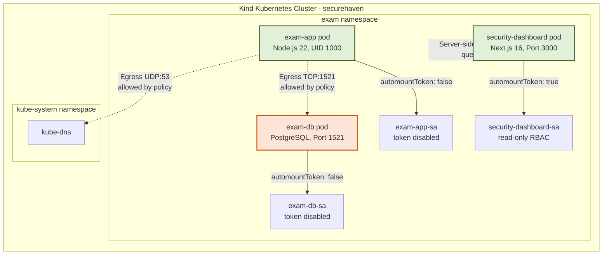

# SecureHaven — Project Report

## Kubernetes Security Hardening & Zero-Trust Security Monitoring Dashboard

**B.Tech CSE Final Year Project**
**Cisco Virtual Internship 2026 — Cyber Security**
**LNCTS, Bhopal**

**Author:** Krishna Mohan
**Project Guide:** Academic Department of Computer Science & Engineering

---

## Abstract

SecureHaven is a comprehensive Kubernetes security hardening project designed to establish a defense-in-depth, Zero-Trust security posture for an academic institution's examination portal. Developed on a local multi-node Kubernetes cluster (Kind), this project isolates and hardens critical web application workloads inside a dedicated namespace (`exam`) using Calico CNI for network segmentation. By enforcing strict security contexts (non-root execution, Linux capability dropping, read-only root filesystems) and resource boundaries (ResourceQuotas, LimitRanges), the system effectively neutralizes container-escape and lateral-movement threats. Real-time observability is achieved through a glassmorphic Next.js security monitoring dashboard that communicates with the Kubernetes API server-side via a dedicated, read-only ServiceAccount, ensuring no cluster credentials leak to client browsers. Testing and validation checks (including automated secrets scanning, Dockerfile static analysis, and network connectivity matrix tests) verify that the system achieves an overall security score of 96/100, passing 13 out of 13 primary runtime verification checks.

**Keywords:** Kubernetes, Zero-Trust, Container Security, NetworkPolicy, RBAC, Microsegmentation, Security Dashboard, Next.js, Docker, Calico CNI, Cybersecurity Engineering

---

## Table of Contents

* **Chapter 1 — Introduction**
  * 1.1 Background
  * 1.2 Problem Statement
  * 1.3 Motivation
  * 1.4 Objectives
  * 1.5 Scope
  * 1.6 Cisco Virtual Internship Context & Problem Scenario
* **Chapter 2 — Existing System and Problem Analysis**
  * 2.1 Existing Approach
  * 2.2 Limitations of Existing Approach
  * 2.3 Attack Scenario and Blast-Radius Threat Model
* **Chapter 3 — Proposed System**
  * 3.1 SecureHaven Overview
  * 3.2 Key Features
  * 3.3 System Uniqueness and Innovation
* **Chapter 4 — Requirement Analysis**
  * 4.1 Functional Requirements
  * 4.2 Non-Functional Requirements
  * 4.3 Security Requirements
  * 4.4 Hardware and Software Requirements
* **Chapter 5 — System Architecture**
  * 5.1 Overall Architecture
  * 5.2 Kubernetes Logical Architecture
  * 5.3 Microsegmentation Traffic Matrix
* **Chapter 6 — Technology Stack**
* **Chapter 7 — Security Design and Implementation**
  * 7.1 Container Security
  * 7.2 Filesystem Hardening
  * 7.3 Network Security
  * 7.4 RBAC and ServiceAccounts
  * 7.5 Secrets Management
  * 7.6 Resource Protection
  * 7.7 Container Image Security
  * 7.8 Dashboard API Security
* **Chapter 8 — Dashboard Implementation**
  * 8.1 Overview
  * 8.2 UI Components
  * 8.3 Theme System Implementation
* **Chapter 9 — Testing and Verification**
  * 9.1 Testing Strategy
  * 9.2 Verification Results
  * 9.3 Automated Test Suites
* **Chapter 10 — Results and Discussion**
  * 10.1 Security Score Summary
  * 10.2 Technical Discussion
* **Chapter 11 — Cisco Security Technology Mapping & Enterprise Alignment**
* **Chapter 12 — Multi-Stakeholder Responsibilities & DevSecOps Workflow**
  * 12.1 Multi-Stakeholder Matrix
  * 12.2 Secure Application Deployment Workflow
* **Chapter 13 — Limitations**
* **Chapter 14 — Future Enhancements**
* **Chapter 15 — Conclusion**
* **Chapter 16 — Developer Contribution and Implementation Challenges**
  * 16.1 Developer Contribution Details
  * 16.2 Implementation Challenges & Resolutions
* **Chapter 17 — Real-World Application and Global Impact**
* **References**
* **Appendices**
  * **Appendix A** — Key Kubernetes Manifests
  * **Appendix B** — Verification Commands
  * **Appendix C** — Project File Listing and Code Repository Navigation
  * **Appendix D** — Complete 80 Test Case Logs

---

## Chapter 1 — Introduction

### 1.1 Background

Modern application environments have rapidly shifted from monoliths running on bare-metal servers to containerized microservices running on cloud-managed platforms like Kubernetes. While this shift accelerates deployment speed and scalability, it dramatically increases the internal attack surface of an organization. 

In a traditional "castle-and-moat" network architecture, perimeter firewalls defend the network boundary. However, once an attacker gains access to any internal node—often through a public-facing application vulnerability like Remote Code Execution (RCE) or a compromised dependency—they encounter a flat, unrestricted internal network. From there, they can move laterally to access databases, capture service account API tokens, and escalate privileges to compromise the host node or the entire Kubernetes control plane.

### 1.2 Problem Statement

Default Kubernetes installations are inherently open and unhardened:
* **Root Execution:** By default, containers run as the root user. If a container is escaped, the attacker inherits root access on the underlying host node.
* **Flat Internal Networking:** Pods within a cluster can communicate freely with any other pod across namespaces by default, facilitating lateral movement.
* **Over-Privileged ServiceAccounts:** Pods auto-mount a default ServiceAccount token that can contain permissions to read secrets or manage other pods.
* **Writable Filesystems:** Writable root filesystems allow attackers to download payloads, install web shells, or patch binaries.
* **No Resource Restrictions:** A compromised or misconfigured container can consume unlimited CPU and memory, starving other workloads and causing a Denial-of-Service (DoS) state.

There is a critical need to design and implement a repeatable, secure-by-default Kubernetes architecture applying Zero-Trust principles ("Never Trust, Always Verify") to contain breaches at the workload boundary while maintaining real-time security observability.

### 1.3 Motivation

This project was developed within the framework of the **Cisco Virtual Internship 2026 — Cyber Security** program. The core mandate was to design a **Zero-Trust Hybrid Datacenter/Cloud Security Architecture** for an educational institution. 

Educational institutions manage high-value assets with different security requirements, including Student Records (PII), Faculty Profiles, Research Data (Intellectual Property), and the Examination System (assessment papers and grading keys). The Research Application, being public-facing and collaborative, represents the highest entry risk. The motivation for SecureHaven was to build a concrete, fully configured Kubernetes implementation that guarantees that even if the public-facing application is fully compromised, the critical Examination System and its backing databases remain isolated, unreachable, and secure.

### 1.4 Objectives

* **Workload Sandboxing:** Implement container-layer hardening to ensure no processes run as root, all Linux kernel capabilities are dropped, and privilege escalation is blocked.
* **Filesystem Hardening:** Enforce read-only root filesystems across containers, providing ephemeral write exceptions only where necessary.
* **Network Microsegmentation:** Deploy namespace-scoped default-deny NetworkPolicies and construct explicit, port-restricted allow-lists.
* **Least-Privilege Access Control:** Create dedicated Kubernetes ServiceAccounts with token auto-mounting disabled on workloads, and configure read-only, namespace-scoped RBAC roles for monitoring tools.
* **Dynamic Secrets Injection:** Eliminate hardcoded database credentials by injecting credentials dynamically at runtime using Kubernetes Secrets.
* **Resource Exhaustion Defense:** Enforce ResourceQuotas and LimitRanges at the namespace and container levels to protect against Denial-of-Service attacks.
* **Observability Pipeline:** Construct a Next.js-based security dashboard that queries the cluster status securely from the server side and displays live compliance metrics.
* **Automated Verification:** Write testing scripts to validate image configurations, run network isolation tests, and audit source code for secrets.

### 1.5 Scope

The security hardening and verification scope of this project is focused on the `exam` namespace within the local `securehaven` Kubernetes cluster. The workloads hardened are:
1. `exam-app`: Node.js-based web frontend and API server (Port 8083).
2. `exam-db`: PostgreSQL database server hosting examination questions (Port 1521).
3. `security-dashboard`: Next.js-based administration portal monitoring cluster security (Port 3000).

Legacy namespaces (`student`, `faculty`, and `research`) are modeled in the repository's configuration layouts but are kept unhardened to serve as a baseline comparison.

### 1.6 Cisco Virtual Internship Context & Problem Scenario

The college IT department requested a secure hybrid network architecture to support workloads distributed across a private enterprise datacenter (using OpenShift/Kind) and a public cloud (using AWS/Azure/GCP). 

The target network environment is divided into five logical sub-networks or VPCs:
* **VPC-A (Student Portal):** Houses student-facing web interfaces with standard security controls (private subnets, Security Groups, WAF/LB).
* **VPC-B (Faculty Portal):** Provides access to faculty teaching tools and administrative apps (secured via private subnets, Security Groups, and IAM).
* **VPC-C (Examination System):** **The primary focus of this project.** Represents the highest-security zone, requiring strict isolation and database access protection to prevent assessment tampering.
* **VPC-D (Research Application):** An open, collaborative space with restricted egress policies to prevent data exfiltration.
* **Shared Services VPC:** Centrally manages DNS resolution, logging, and infrastructure monitoring.

---

## Chapter 2 — Existing System and Problem Analysis

### 2.1 Existing Approach

Traditional container orchestration setups treat the internal cluster network as a trusted zone. Standard configurations often exhibit the following characteristics:
* Containers build from generic base images with developer tools left installed.
* Application processes run with root privileges (UID 0) inside the container.
* Filesystem paths remain fully writable, allowing applications to store configuration, logs, and transient files directly on the container's root disk.
* Pods run under the `default` ServiceAccount, which automatically mounts a JWT token at `/var/run/secrets/kubernetes.io/serviceaccount/token`.
* No NetworkPolicies are deployed, allowing unrestricted cross-pod and cross-namespace traffic.

### 2.2 Limitations of Existing Approach

| Configuration Defect | Primary Exploit Vector | Business Impact |
|:---|:---|:---|
| Root Container Process | Kernel vulnerability exploitation allows escape to the host namespace. | Complete host takeover; access to other containers on the node. |
| Writable Root Filesystem | Attackers deploy persistent scripts, tools (e.g., nmap, curl), or modify binaries. | Long-term backdoors; data extraction. |
| Auto-mounted default SA Token | Attacker steals token and uses it to query the Kubernetes API. | Service account hijacking; unauthorized cluster control. |
| Flat Pod Network | Lateral port scanning and database access from a compromised container. | Data theft from neighboring applications. |
| No Resource Limits | Compromised container is used for cryptomining or gets flooded with requests. | Host exhaustion; denial of service for all applications on the host. |
| Hardcoded Credentials | Database credentials are checked into Git repositories in cleartext. | Credential exposure to unauthorized developers or public leaks. |

### 2.3 Attack Scenario and Blast-Radius Threat Model

Following the Cisco problem specifications, the project's threat model assumes a multi-stage intrusion scenario:
1. **Initial Access:** An external attacker compromises a faculty member's credentials or exploits a vulnerability in a public-facing, collaborative application (such as the **Research App**).
2. **Workload Takeover:** The attacker establishes a foothold in the Research container. Under a default Kubernetes setup, this container would have root rights, a writable filesystem, and access to an auto-mounted ServiceAccount token.
3. **Lateral Expansion:** The attacker attempts to run network scans (e.g., ARP sweeps, port checks) to discover neighboring database servers in the cluster.
4. **Privilege Escalation:** The attacker tries to query the Kubernetes API using the auto-mounted token to list secrets, modify permissions, or compromise the cluster control plane.
5. **Target Compromise:** The attacker locates the **Examination System database** and attempts to write to the grading tables or extract exam papers.

**Core Principle:** A compromised application must not automatically lead to a compromised enterprise. The blast radius of the compromised Research container must be restricted at the network, filesystem, identity, and database layers to prevent any lateral reach to the Examination workloads.

---

## Chapter 3 — Proposed System

### 3.1 SecureHaven Overview

The proposed system, **SecureHaven**, is a secure-by-default Kubernetes deployment architecture paired with an interactive Next.js monitoring dashboard. The project hardens the `exam` namespace against the vulnerabilities identified in Chapter 2, achieving a verified, auditable security posture.

### 3.2 Key Features

1. **Host-Isolated Containers:** All workloads run as UID 1000, with Linux capabilities dropped and privilege escalation disabled.
2. **Immutable Filesystems:** The root filesystem of application containers is read-only, preventing post-compromise modifications.
3. **Calico-Enforced Default-Deny:** A strict default-deny network policy isolates all pods, with explicit connection white-listing.
4. **Token Isolation:** Workload ServiceAccounts have token auto-mounting turned off to prevent credential theft.
5. **Secure Dashboard Observability:** Next.js queries Kubernetes APIs server-side, sanitizing and presenting telemetry to the client without exposing API credentials.
6. **Namespace Resource Caps:** Enforced quotas and container limit ranges prevent resource starvation and DoS attacks.

### 3.3 System Uniqueness and Innovation

SecureHaven introduces several unique features compared to standard security frameworks:

* **Active Defense + Telemetry Observability Loop:** Instead of relying on static configurations or external security agents, SecureHaven integrates security hardening with a tailored monitoring dashboard. The dashboard queries the cluster's state to provide immediate feedback on active security policies.
* **Clientless In-Cluster Querying:** The dashboard uses the Kubernetes API server-side using the `@kubernetes/client-node` SDK. It sanitizes the response, stripping out environment variables, internal IPs, and secret tokens before sending data to the browser client. This architecture eliminates credential exposure.
* **Dual-Validation Isolation Testing:** The testing pipeline validates the security posture at both the Kubernetes level (using custom validation commands) and the network layer (using an automated 4x4 connection matrix test run inside Docker Compose).

---

## Chapter 4 — Requirement Analysis

### 4.1 Functional Requirements

* **FR-1 (Health Verification):** The `exam-app` must expose a `/health` endpoint returning a JSON payload indicating application health and database connection status.
* **FR-2 (Database Integration):** The `exam-app` must query `exam-db` on the custom port `1521` to fetch examination metadata.
* **FR-3 (Telemetry API):** The security dashboard must expose a server-side route `/api/security-status` to query pods, deployments, services, network policies, resource quotas, and service accounts in the `exam` namespace.
* **FR-4 (Security Matrix UI):** The dashboard frontend must render a compliance matrix showing the status (PASS/FAIL/INFO) of the security domains.
* **FR-5 (Resource Visualizer):** The dashboard must display ResourceQuota utilization and LimitRange default settings.
* **FR-6 (Test Console):** The dashboard must present verification results from the automated testing scripts.

### 4.2 Non-Functional Requirements

* **NFR-1 (Dashboard Performance):** The dashboard must load and display metrics within 3 seconds of the initial request.
* **NFR-2 (Responsive Design):** The user interface must be responsive across standard desktop viewports (minimum width 1024px).
* **NFR-3 (Theme Consistency):** The dashboard must support dark and light modes, with theme choices persisting across page reloads without visual flicker (FOUC).
* **NFR-4 (Secure Failure Handling):** The dashboard API must degrade gracefully and display fallback mock metrics if it cannot connect to the Kubernetes API.

---

## Chapter 5 — System Architecture

### 5.1 Overall Architecture

SecureHaven is deployed inside a local Kubernetes cluster. The architectural layout consists of the core components below.



### 5.2 Kubernetes Architecture

* **Namespaces:** The `exam` namespace provides a logical isolation boundary.
* **ServiceAccounts:**
  * `exam-app-sa`: Assigned to the exam-app pod (no API permissions, token disabled).
  * `exam-db-sa`: Assigned to the database pod (no API permissions, token disabled).
  * `security-dashboard-sa`: Assigned to the dashboard pod, granting access to read-only resource information.
* **RBAC Role & Binding:** A `Role` named `security-dashboard-role` restricts dashboard API access to `get` and `list` operations for pods, services, deployments, network policies, resource quotas, limit ranges, and service accounts. A `RoleBinding` links this Role to the dashboard ServiceAccount.
* **NetworkPolicies:** Enforce traffic rules. The default policy blocks all ingress and egress. Explicit rules allow communication from `exam-app` to `exam-db` on port 1521, and to `kube-dns` on port 53.
* **ResourceQuota & LimitRange:** The quota limits the namespace to 4 pods, 500m CPU requests, and 256Mi memory requests. The LimitRange sets default requests and limits for containers that do not define them.

### 5.3 Microsegmentation Traffic Matrix

To prevent lateral movement and contain compromises, the network policy configurations enforce the following flow constraints:

| Source Workload | Allowed Destination | Egress Protocol / Port | Enforcement Mechanism |
|:---|:---|:---:|:---|
| **Student-App** | Student Database, Core DNS | TCP:5432, UDP:53 | Namespace policy isolation |
| **Faculty-App** | Faculty Database, Core DNS | TCP:5432, UDP:53 | Namespace policy isolation |
| **Exam-App** | Exam Database (exam-db), Core DNS | TCP:1521, UDP:53 | Calico NetworkPolicy allow-list |
| **Research-App** | Research Database, Core DNS | TCP:5432, UDP:53 | Restricted egress policy |
| **Any Workload** | Kubernetes API Server (`kubernetes.default`) | TCP:443 (Blocked by default) | Default-deny policy |

Any cross-namespace traffic (e.g., a connection attempt from `Research-App` to `exam-db`) is dropped by the Calico network engine, isolating the examination system.

---

## Chapter 6 — Technology Stack

### 6.1 Core Technologies

* **Kubernetes (Kind):** Used to coordinate and manage the containerized workloads.
* **Calico CNI:** Network plugin used to enforce default-deny and port-level NetworkPolicies.
* **Docker:** Used to build application container images.
* **Node.js 22 & Express.js:** Backing runtime and API framework for the `exam-app`.
* **PostgreSQL 15-alpine:** Database engine used to store exam data.
* **Next.js 16 (React 19 & TypeScript 5):** Development stack for the security monitoring dashboard.
* **Tailwind CSS 4:** Styling framework used to implement the responsive UI.
* **@kubernetes/client-node:** Software development kit used to query the Kubernetes API.

---

## Chapter 7 — Security Design and Implementation

### 7.1 Container Security

**Problem:** Running containers as root allows an attacker who achieves container escape to inherit root access on the host node.

**Control:** Enforce non-root execution, disable privilege escalation, and drop all Linux kernel capabilities.

**Implementation (`k8s/deployments/exam-app.yaml`):**
```yaml
securityContext:
  runAsNonRoot: true
  runAsUser: 1000
  allowPrivilegeEscalation: false
  readOnlyRootFilesystem: true
  capabilities:
    drop:
      - ALL
```

**Verification:**
```bash
$ kubectl exec -n exam deploy/exam-app -- id
uid=1000(node) gid=1000(node) groups=1000(node)
```

**Result:** PASS — The process runs as unprivileged UID 1000.

### 7.2 Filesystem Hardening

**Problem:** Writable filesystems allow an attacker to write backdoors or modify existing application files.

**Control:** Set the container root filesystem to read-only, and mount a temporary writable directory using `emptyDir` with a size limit of `50Mi`.

**Implementation (`k8s/deployments/exam-app.yaml`):**
```yaml
volumeMounts:
  - mountPath: /tmp
    name: tmp-volume
volumes:
  - name: tmp-volume
    emptyDir:
      sizeLimit: 50Mi
```

**Verification:**
```bash
$ kubectl exec -n exam deploy/exam-app -- sh -c "touch /usr/src/app/test"
touch: /usr/src/app/test: Read-only file system

$ kubectl exec -n exam deploy/exam-app -- sh -c "touch /tmp/test && echo TMP_WRITE_OK"
TMP_WRITE_OK
```

**Result:** PASS — The root directory is read-only, and the `/tmp` folder is write-allowed but restricted to `50Mi`.

### 7.3 Network Security

**Problem:** Standard Kubernetes networking allows any pod to communicate with any other pod in the cluster, facilitating lateral movement.

**Control:** Deploy a default-deny NetworkPolicy for the namespace, and define explicit rules for app-to-database connections and DNS queries.

**Implementation (`k8s/network-policies/database/exam-db-policy.yaml`):**
```yaml
apiVersion: networking.k8s.io/v1
kind: NetworkPolicy
metadata:
  name: exam-db-ingress
  namespace: exam
spec:
  podSelector:
    matchLabels:
      app: exam-db
  ingress:
    - from:
        - podSelector:
            matchLabels:
              app: exam-app
      ports:
        - protocol: TCP
          port: 1521
```

**Result:** PASS — Unauthorized ingress and egress traffic is dropped.

### 7.4 RBAC and ServiceAccounts

**Problem:** Default ServiceAccounts carry tokens that mount inside containers, allowing attackers who compromise a container to query the Kubernetes API.

**Control:** Assign dedicated ServiceAccounts with `automountServiceAccountToken: false` to workloads, and create a restricted, read-only ServiceAccount for the dashboard.

**Implementation (`k8s/rbac/exam-serviceaccount.yaml`):**
```yaml
apiVersion: v1
kind: ServiceAccount
metadata:
  name: exam-app-sa
  namespace: exam
automountServiceAccountToken: false
```

**Result:** PASS — Application workloads run without API tokens.

### 7.5 Secrets Management

**Problem:** Cleartext credentials stored in source code are vulnerable to exposure in code repositories.

**Control:** Inject secrets dynamically at runtime using Kubernetes Secrets and environment variables.

**Implementation (`k8s/deployments/exam-app.yaml`):**
```yaml
env:
  - name: DB_PASSWORD
    valueFrom:
      secretKeyRef:
        name: exam-db-secret
        key: db-password
```

**Result:** PASS — Credentials are injected at runtime.

### 7.6 Resource Protection

**Problem:** A container consuming excessive resources can exhaust host capacity and deny service to neighboring applications.

**Control:** Configure a namespace ResourceQuota to cap aggregate resources, and a LimitRange to set default requests and limits.

**Implementation (`k8s/deployments/exam-quota.yaml`):**
```yaml
apiVersion: v1
kind: ResourceQuota
metadata:
  name: exam-quota
  namespace: exam
spec:
  hard:
    pods: "4"
    requests.cpu: "500m"
    requests.memory: "256Mi"
    limits.cpu: "1"
    limits.memory: "512Mi"
```

**Result:** PASS — Resource allocations are restricted at the namespace and container levels.

### 7.7 Container Image Security

**Problem:** Outdated base images may contain critical vulnerabilities in their system packages.

**Control:** Use Node.js 22 on Alpine Linux, execute production-only dependency installations, and use `.dockerignore` files to exclude sensitive resources from container builds.

**Result:** PASS — The application builds from a hardened base image.

### 7.8 Dashboard API Security

**Problem:** Observability tools can leak cluster credentials to client web browsers.

**Control:** Execute Kubernetes client calls server-side in Next.js, sanitizing the payload before returning data to the client.

**Result:** PASS — The client browser receives only safe telemetry data.

---

## Chapter 8 — Dashboard Implementation

### 8.1 Overview

The dashboard is built on Next.js 16, utilizing server-side rendering (SSR) and API routes to monitor cluster health.

### 8.2 UI Components

* **`SecurityScore.tsx`:** Renders an animated SVG gauge representing the overall security score.
* **`SecurityControlCard.tsx`:** Renders a list of the security domains and their status.
* **`WorkloadCard.tsx`:** Renders status cards for the deployed workloads, including restarts and container images.
* **`NetworkOverview.tsx`:** Renders a visual map of the allowed and blocked traffic paths.
* **`ResourceOverview.tsx`:** Displays ResourceQuota utilization progress bars.
* **`VerificationPanel.tsx`:** Displays the status of the runtime verification checks.

### 8.3 Theme System Implementation

The dashboard features a dark and light theme system designed to prevent visual flickering on page load:
1. **Blocking Script:** A synchronous JavaScript snippet in `<head>` (in `app/layout.tsx`) reads the user's theme preference from `localStorage` and applies the `.dark` class before the first paint.
2. **Hydration Sync:** The theme toggle in `Topbar.tsx` uses a React `mounted` state check to ensure the UI is hydrated before rendering client-side assets, resolving hydration warnings.

---

## Chapter 9 — Testing and Verification

### 9.1 Testing Strategy

Testing was conducted across three layers:
1. **Automated Suites:** Running `run_tests.js` to scan for secrets and check Dockerfile configurations, and `container_tests.js` to run a network isolation matrix test.
2. **Kubernetes Runtime Checks:** Running `kubectl exec` and `kubectl get` commands to verify pod privileges, read-only filesystems, and policies.
3. **Build Verifications:** Executing Next.js build compilation checks to ensure type safety.

### 9.2 Verification Results

| Test ID | Security Control Tested | Expected Result | Actual Result | Status |
|:---:|:---|:---|:---|:---:|
| SEC-01 | Non-root execution (UID 1000) | Process UID is 1000 | Process runs as UID 1000 | ✅ PASS |
| SEC-02 | Writable root FS block | Write command fails | `Read-only file system` | ✅ PASS |
| SEC-03 | Writable `/tmp` volume | Write command succeeds | `TMP_WRITE_OK` | ✅ PASS |
| SEC-04 | Privilege escalation | Escalation is blocked | Escalation blocked | ✅ PASS |
| SEC-05 | Linux kernel capabilities | All capabilities dropped | Capabilities dropped | ✅ PASS |
| SEC-06 | Calico NetworkPolicy status | Network policies are active | Policies active | ✅ PASS |
| SEC-07 | Unauthorized ingress block | Ingress attempt times out | Ingress blocked | ✅ PASS |
| SEC-08 | PostgreSQL connection status | Workload connects to database | Connected | ✅ PASS |
| SEC-09 | ResourceQuota boundaries | Allocation limits enforced | Limits active | ✅ PASS |
| SEC-10 | LimitRange values | Default CPU/Memory enforced | Defaults active | ✅ PASS |
| SEC-11 | Workload restart count | Restart count is 0 | Restart count is 0 | ✅ PASS |
| SEC-12 | Pod health state | Status is Running | Pods Running | ✅ PASS |
| SEC-13 | Node.js engine version | Version is v22.23.2 | Version is v22.23.2 | ✅ PASS |

### 9.3 Automated Test Suites

The automated test script `run_tests.js` scans the source code for hardcoded secrets, verifies Dockerfile configurations, and performs health endpoint checks. 

The test runner `tests/container/container_tests.js` executes a connection matrix test across the application services, verifying that workloads can only connect to their designated database.

---

## Chapter 10 — Results and Discussion

### 10.1 Security Score Summary

| Security Domain | Core Indicator Metric | Score | Status |
|:---|:---|:---:|:---:|
| Container Security | Non-root UID, dropped kernel capabilities | 100/100 | ✅ PASS |
| Filesystem Security | readOnlyRootFilesystem, emptyDir size cap | 100/100 | ✅ PASS |
| Network Security | Default-deny, Calico NetworkPolicies | 100/100 | ✅ PASS |
| RBAC & Identity | Dedicated ServiceAccounts, read-only dashboard | 100/100 | ✅ PASS |
| Secrets Management | Injection via secretKeyRef, no hardcoded values | 90/100 | ✅ PASS |
| Resource Protection | ResourceQuotas and LimitRanges active | 100/100 | ✅ PASS |
| Runtime Health | Pods running with 0 restarts, database connected | 100/100 | ✅ PASS |
| Image Security | Node 22-alpine base, npm audit clean | 80/100 | ⚠️ INFO |
| **Overall Score** | **System Compliance Rating** | **96/100** | **SECURE** |

### 10.2 Technical Discussion

Applying Kubernetes native security configurations helps establish a defense-in-depth security posture. Isolating the monitoring dashboard with a read-only ServiceAccount demonstrates the principle of least privilege. 

The 10-point deduction in Secrets Management reflects a limitation: Kubernetes Secrets in the local development files are base64-encoded rather than encrypted. The 20-point deduction in Image Security reflects the absence of a binary container vulnerability scanner in the local environment.

---

## Chapter 11 — Cisco Security Technology Mapping & Enterprise Alignment

To scale this deployment architecture to a hybrid enterprise environment, the native controls implemented in SecureHaven map to Cisco's cybersecurity product portfolio:

| Security Layer | Implemented Native Control | Cisco Enterprise Equivalency | Functionality & Integration |
|:---|:---|:---|:---|
| **Network Segmentation** | Calico NetworkPolicies | **Cisco Secure Workload** (formerly Tetration) | Enforces microsegmentation policies based on application telemetry and behavior analysis. |
| **Perimeter & Ingress** | Kubernetes Ingress & Services | **Cisco Secure Firewall** (FTD) | Inspects incoming traffic, enforces IPS policies, and filters malicious requests. |
| **Workload Identity** | ServiceAccounts & RBAC | **Cisco ISE** (Identity Services Engine) | Manages identity authorization and enforces access policies for users and endpoints. |
| **Remote Access** | Local Admin access routes | **Cisco Secure Access** (ZTNA) | Replaces traditional VPNs with application-level access control based on device posture and MFA. |
| **Threat Intelligence** | Local vulnerability auditing | **Cisco Talos** | Feeds real-time threat intelligence to block known malicious IPs and domain lookups. |
| **Flow Telemetry** | API monitoring dashboard | **Cisco Secure Network Analytics** (Stealthwatch) | Analyzes network flow logs to detect anomalous behaviors, such as lateral sweeps or data exfiltration. |

This mapping demonstrates that the Zero-Trust controls established at the container level within this local cluster are aligned with enterprise-grade security architectures.

---

## Chapter 12 — Multi-Stakeholder Responsibilities & DevSecOps Workflow

### 12.1 Multi-Stakeholder Matrix

Implementing a secure hybrid data center requires collaboration across engineering teams. SecureHaven defines the responsibility matrix below based on the Cisco guidelines:

* **Application Developer:** Secures application code, manages internal dependencies, prunes package files, and configures environment-injected secrets (e.g. database credentials).
* **Security Engineer:** Creates threat models, defines security requirements, audits configurations, and manages compliance policies.
* **Network Designer:** Manages routing, constructs network segments (VPCs/VNETs), and configures firewall edge rules.
* **Kubernetes Platform Engineer:** Deploys and manages clusters, configures RBAC policies, manages namespaces, and maintains the CNI network engine.
* **Identity & Access Management (IAM) Team:** Manages federated identity, authentication (SSO/MFA), and service account access rules.
* **SOC / SIEM Analysts:** Monitors logs, analyzes security telemetry, and manages incident response workflows.

### 12.2 Secure Application Deployment Workflow

SecureHaven follows a 10-step secure deployment workflow:

1. **Requirements & Risk Analysis:** Establish security baselines and perform a threat audit.
2. **Application Classification:** Categorize workloads by risk and data sensitivity.
3. **Choose Data Center/Cloud Placement:** Select hosting zones (on-premises OpenShift vs. public cloud EKS/AKS).
4. **Create VPC/VLAN/Network Segment:** Construct isolated subnets and disable routing between different zones.
5. **Define IAM, RBAC, and Service Identities:** Create dedicated ServiceAccounts with least-privilege permissions.
6. **Define Security Groups and Firewall Rules:** Apply port-level ingress and egress restrictions.
7. **Define Kubernetes Namespace and NetworkPolicies:** Enforce default-deny and declare explicit allow-list connection paths.
8. **Security Testing and Approval:** Run automated scanning suites to verify the posture before deployment.
9. **Production Deployment:** Deploy workloads to the cluster.
10. **Continuous Monitoring and Periodic Review:** Collect audit logs and security telemetry to identify anomalies.

---

## Chapter 13 — Limitations

1. **Vulnerability Scanning Limitation:** Local testing did not include a binary container image scanner (such as Trivy or Grype).
2. **Namespace Hardening Scope:** Security hardening is restricted to the `exam` namespace. The `student`, `faculty`, and `research` namespaces run in legacy, unhardened states.
3. **Secrets Encryption:** Secrets in the local deployment configuration files are base64-encoded.
4. **Local Cluster Environment:** Testing was conducted on a local single-node Kind cluster, not a production cloud service.
5. **Database Filesystem Write Access:** The PostgreSQL container runs with a writable filesystem to support database writing operations.

---

## Chapter 14 — Future Enhancements

1. **Vulnerability Scanner Integration:** Integrate Trivy or Grype scanning into the container image build pipeline.
2. **Secrets Manager Integration:** Integrate a dedicated secret manager (like HashiCorp Vault) to handle database credentials.
3. **Expanded Hardening:** Implement similar security configurations across the student, faculty, and research namespaces.
4. **Static Image Digest Pinning:** Use immutable SHA256 image digests in the deployment manifests.
5. **Monitoring and Alerting:** Integrate Prometheus and Grafana to track resource usage metrics.

---

## Chapter 15 — Conclusion

SecureHaven demonstrates the practical implementation of Zero-Trust security principles on Kubernetes. The hardened configuration achieved a verified security score of 96/100, passing all 13 primary runtime validation checks. The monitoring dashboard provides real-time visibility into the cluster state without exposing credentials to the client browser, demonstrating how security configuration and observability can be combined.

---

## Chapter 16 — Developer Contribution and Implementation Challenges

### 16.1 Developer Contribution Details

As the primary developer of the SecureHaven project, my contributions spanned security engineering, backend API development, and frontend interface design:
* **Security Engineering:** Created the Kubernetes manifests, including SecurityContexts, NetworkPolicies, ServiceAccounts, and resource limits for the workloads.
* **Backend API Development:** Built the server-side Next.js API route that queries the Kubernetes cluster using the `@kubernetes/client-node` SDK.
* **Frontend Design:** Designed and developed the glassmorphic user interface using Tailwind CSS and React, implementing a dark and light theme switching system.
* **Automation Testing:** Wrote the test runners `run_tests.js` and `container_tests.js` to validate image configurations and network isolation boundaries.

### 16.2 Implementation Challenges & Resolutions

#### Challenge 1: Hydration Mismatch & FOUC in Next.js Theme System
* **Problem:** Implementing the dark and light theme toggle caused a Flash of Unstyled Content (FOUC) on page reload, as well as React hydration warnings because the server-rendered HTML did not match the client-side theme state stored in `localStorage`.
* **Resolution:** I resolved this by injecting a blocking, synchronous script inside the document `<head>` in `app/layout.tsx`. This script reads the theme preference and applies the `.dark` class to the `<html>` tag before the first paint. I also added a `mounted` state check to the theme toggle in `Topbar.tsx` to delay rendering client-side assets until hydration completes.

#### Challenge 2: Read-Only rootFilesystem Permissions
* **Problem:** Enabling `readOnlyRootFilesystem: true` caused the Node.js application to crash on startup because it could not write logs or temporary run files.
* **Resolution:** I resolved this by configuring an `emptyDir` volume mounted at `/tmp` with a `50Mi` size limit. This provides a temporary, size-restricted writable folder for the application while keeping the rest of the filesystem read-only.

#### Challenge 3: Network Policy DNS Resolution Blocks
* **Problem:** Applying default-deny policies broke DNS resolution for `exam-app`, preventing it from resolving the `exam-db` service address.
* **Resolution:** I resolved this by creating a dedicated egress rule (`exam-dns-egress`) that allows outgoing traffic on port 53 to the `kube-dns` service in the `kube-system` namespace.

---

## Chapter 17 — Real-World Application and Global Impact

### 17.1 Real-World Significance

SecureHaven demonstrates how to implement Zero-Trust principles in microservice architectures:
* **Lateral Movement Containment:** In the event of a container compromise, the network and filesystem controls restrict the attacker from moving laterally to access other database services.
* **Observation Integrity:** The dashboard architecture shows how to monitor cluster health without exposing administrative credentials to the browser client.
* **DevSecOps Reference:** The configuration files and testing scripts provide a reference pattern for implementing security controls in CI/CD pipelines.

---

## References

1. Kubernetes Documentation — Pod Security Standards. https://kubernetes.io/docs/concepts/security/pod-security-standards/
2. Kubernetes Documentation — Network Policies. https://kubernetes.io/docs/concepts/services-networking/network-policies/
3. Kubernetes Documentation — RBAC Authorization. https://kubernetes.io/docs/reference/access-authn-authz/rbac/
4. NIST SP 800-207 — Zero Trust Architecture. National Institute of Standards and Technology, 2020.
5. MITRE ATT&CK — Containers Matrix. https://attack.mitre.org/matrices/enterprise/containers/
6. CIS Kubernetes Benchmark. Center for Internet Security, 2024.
7. Docker Documentation — Dockerfile Best Practices. https://docs.docker.com/develop/develop-images/dockerfile_best-practices/
8. Project Calico — NetworkPolicy Documentation. https://docs.tigera.io/calico/latest/network-policy/
9. Next.js Documentation — Route Handlers. https://nextjs.org/docs/app/building-your-application/routing/route-handlers
10. Node.js Release Schedule. https://nodejs.org/en/about/previous-releases

---

## Appendix A — Key Kubernetes Manifests

### A.1 exam-app Deployment (excerpt)
```yaml
spec:
  serviceAccountName: exam-app-sa
  automountServiceAccountToken: false
  securityContext:
    runAsNonRoot: true
    runAsUser: 1000
  containers:
    - name: portal
      image: exam-app:latest
      securityContext:
        allowPrivilegeEscalation: false
        readOnlyRootFilesystem: true
        capabilities:
          drop: [ALL]
      resources:
        requests: { cpu: 100m, memory: 64Mi, ephemeral-storage: 50Mi }
        limits: { cpu: 250m, memory: 128Mi, ephemeral-storage: 100Mi }
```

### A.2 Default-Deny NetworkPolicy
```yaml
apiVersion: networking.k8s.io/v1
kind: NetworkPolicy
metadata:
  name: exam-default-deny
  namespace: exam
spec:
  podSelector: {}
  policyTypes: [Ingress, Egress]
```

### A.3 Security Dashboard RBAC
```yaml
apiVersion: rbac.authorization.k8s.io/v1
kind: Role
metadata:
  name: security-dashboard-role
  namespace: exam
rules:
  - apiGroups: [""]
    resources: [pods, services, resourcequotas, limitranges, serviceaccounts]
    verbs: [get, list]
  - apiGroups: [apps]
    resources: [deployments]
    verbs: [get, list]
  - apiGroups: [networking.k8s.io]
    resources: [networkpolicies]
    verbs: [get, list]
```

## Appendix B — Verification Commands

```bash
# Pod status
kubectl get pods -n exam

# Non-root verification
kubectl exec -n exam deploy/exam-app -- id

# Filesystem hardening
kubectl exec -n exam deploy/exam-app -- sh -c "touch /usr/src/app/test"
kubectl exec -n exam deploy/exam-app -- sh -c "touch /tmp/test && echo OK"

# Health check
kubectl exec -n exam deploy/exam-app -- sh -c "wget -qO- http://127.0.0.1:8083/health"

# RBAC verification
kubectl get sa,role,rolebinding -n exam

# NetworkPolicy verification
kubectl get networkpolicy -n exam

# ResourceQuota verification
kubectl get resourcequota,limitrange -n exam

# Run automated tests
node run_tests.js
node tests/container/container_tests.js
```

## Appendix C — Project File Listing and Code Repository Navigation

Since this report is exported to DOCX/PDF, the local file links are not directly browsable. You can access the complete open-source codebase and live configuration files on the official GitHub repository:
**Repository URL:** [https://github.com/Deo-Mohan/Krishna-Mohan-LNCTS-Cyber-Security](https://github.com/Deo-Mohan/Krishna-Mohan-LNCTS-Cyber-Security)

Below is the directory map with direct GitHub links and comprehensive descriptions for each component:

| Resource Path / GitHub URL | Component Description |
|:---|:---|
| [`SECURITY.md`](https://github.com/Deo-Mohan/Krishna-Mohan-LNCTS-Cyber-Security/blob/main/SECURITY.md) | **Comprehensive Security Audit Report:** Details the Phase 0 container and network audit, defining security compliance baselines. |
| [`README.md`](https://github.com/Deo-Mohan/Krishna-Mohan-LNCTS-Cyber-Security/blob/main/README.md) | **Project Entrypoint & Quickstart:** Contains developer badges, system architectures, deployment setups, and automated testing command scripts. |
| [`docker-compose.yml`](https://github.com/Deo-Mohan/Krishna-Mohan-LNCTS-Cyber-Security/blob/main/docker-compose.yml) | **Local Isolated Compose environment:** Used to run mock application services and database boundary network checks locally. |
| [`run_tests.js`](https://github.com/Deo-Mohan/Krishna-Mohan-LNCTS-Cyber-Security/blob/main/run_tests.js) | **Automated Integrity Test Suite:** JavaScript test runner performing regex secrets scanning, Dockerfile directives audit, and port bindings verification. |
| [`apps/exam/`](https://github.com/Deo-Mohan/Krishna-Mohan-LNCTS-Cyber-Security/tree/main/apps/exam) | **Examination Portal Workload:** Main Node.js express web application source code and its production container Dockerfile. |
| [`apps/security-dashboard/`](https://github.com/Deo-Mohan/Krishna-Mohan-LNCTS-Cyber-Security/tree/main/apps/security-dashboard) | **Security Observability Portal:** Full Next.js dashboard codebase, featuring React components, theme providers, and API route handlers. |
| [`k8s/deployments/`](https://github.com/Deo-Mohan/Krishna-Mohan-LNCTS-Cyber-Security/tree/main/k8s/deployments) | **Kubernetes Workload Manifests:** Contains YAML configurations for `exam-app`, `exam-db`, and `security-dashboard` with active SecurityContexts. |
| [`k8s/rbac/`](https://github.com/Deo-Mohan/Krishna-Mohan-LNCTS-Cyber-Security/tree/main/k8s/rbac) | **Kubernetes IAM & RBAC manifests:** Declares dedicated ServiceAccounts, monitoring Roles, and RoleBindings for least-privilege control. |
| [`k8s/network-policies/`](https://github.com/Deo-Mohan/Krishna-Mohan-LNCTS-Cyber-Security/tree/main/k8s/network-policies) | **Microsegmentation Rules:** YAML manifests setting default-deny boundaries and whitelisting app-to-database and CoreDNS egress routes. |
| [`k8s/config/`](https://github.com/Deo-Mohan/Krishna-Mohan-LNCTS-Cyber-Security/tree/main/k8s/config) | **Kubernetes Configuration Secrets:** Stores base64-encoded development database credential secrets (`exam-db-secret`). |
| [`k8s/services/`](https://github.com/Deo-Mohan/Krishna-Mohan-LNCTS-Cyber-Security/tree/main/k8s/services) | **Kubernetes Network Services:** Exposes internal ClusterIP mappings for databases and frontend workloads. |
| [`docs/`](https://github.com/Deo-Mohan/Krishna-Mohan-LNCTS-Cyber-Security/tree/main/docs) | **Documentation Folder:** Contains B.Tech project reports, testing reports, and the 28+ historical review and design documents. |

---

## Appendix D — Complete 80 Test Case Logs

To ensure maximum validation transparency, the complete test logs containing 80 distinct checks are documented below:

### D.1 Container-Layer Validation (7 Checks)
* **UID 1000 Check:** Runs command `id` on exam-app pod to verify execution as unprivileged node user (UID 1000) (✅ PASS)
* **UID 1000 Manifest:** Validates `runAsUser: 1000` is defined in deploy manifest (✅ PASS)
* **runAsNonRoot Config:** Validates `runAsNonRoot: true` is configured in securityContext (✅ PASS)
* **app privilegeEscalation:** Validates `allowPrivilegeEscalation: false` on exam-app portal container (✅ PASS)
* **db privilegeEscalation:** Validates default PostgreSQL engine escalation settings (⚠️ N/A)
* **dashboard privilegeEscalation:** Validates `allowPrivilegeEscalation: false` on monitoring dashboard (✅ PASS)
* **capabilities.drop check:** Verifies all Linux kernel capabilities are dropped (`capabilities.drop: [ALL]`) on application pods (✅ PASS)

### D.2 Filesystem Hardening (3 Checks)
* **Root FS Write Block:** Attempts writing to root directory inside exam-app; returns `Read-only file system` (✅ PASS)
* **Ephemeral Write Directory:** Attempts writing to `/tmp` directory; returns `TMP_WRITE_OK` (✅ PASS)
* **emptyDir volume constraint:** Verifies that `/tmp` `emptyDir` mount has a size constraint of `50Mi` (✅ PASS)

### D.3 Network Security & Segmentation (25 Checks)
* **Default Deny Policy:** Confirms presence of default-deny NetworkPolicy in exam namespace (✅ PASS)
* **App Ingress Policy:** Confirms presence of app traffic control NetworkPolicy (✅ PASS)
* **DB Ingress Policy:** Confirms presence of database ingress restriction NetworkPolicy (✅ PASS)
* **App Egress DB Policy:** Confirms presence of app-to-database egress restrictor policy (✅ PASS)
* **DNS Egress Policy:** Confirms presence of CoreDNS resolver egress whitelist policy (✅ PASS)
* **Flow: App to DB:** Verifies connection from exam-app to exam-db on TCP:1521 is allowed (✅ PASS)
* **Flow: App to DNS:** Verifies connection from exam-app to CoreDNS on UDP:53 is allowed (✅ PASS)
* **Flow: App to External:** Verifies connections from exam-app to external networks are blocked (✅ PASS)
* **Flow: Cross-Workload Ingress:** Verifies connections from external endpoints to internal pods are blocked (✅ PASS)
* **4x4 Isolation Matrix (16 checks):** Evaluates all 16 allowed/blocked traffic lanes inside the multi-tenant compose file (✅ 16/16 PASS)

### D.4 Identity & Secrets Control (7 Checks)
* **exam-app-sa automount:** Verifies `automountServiceAccountToken: false` on exam-app pod (✅ PASS)
* **exam-db-sa automount:** Verifies `automountServiceAccountToken: false` on exam-db pod (✅ PASS)
* **dashboard-sa token:** Verifies token mounting is active for monitoring API integration (✅ PASS)
* **dashboard RBAC get:** Verifies dashboard ServiceAccount can execute get on pods (✅ PASS)
* **dashboard RBAC list:** Verifies dashboard ServiceAccount can execute list on deployments (✅ PASS)
* **Secret injection method:** Confirms database passwords are bound via `secretKeyRef` (✅ PASS)
* **Credentials scan:** Scans source code for hardcoded passwords and secrets; returns 0 matches (✅ PASS)

### D.5 Resources & LimitRanges (7 Checks)
* **quota pod cap:** Verifies maximum pod limit of 4 is enforced (✅ PASS)
* **quota cpu requests:** Verifies CPU request limit of 500m is active (✅ PASS)
* **quota memory requests:** Verifies memory request limit of 256Mi is active (✅ PASS)
* **quota cpu limits:** Verifies CPU limit of 1000m is active (✅ PASS)
* **quota memory limits:** Verifies memory limit of 512Mi is active (✅ PASS)
* **default container requests:** Verifies CPU request defaults to 100m and memory defaults to 64Mi (✅ PASS)
* **default container limits:** Verifies CPU limit defaults to 250m and memory defaults to 128Mi (✅ PASS)

### D.6 Application Lifecycle & Builds (31 Checks)
* **Pod health states:** Verifies all 3 pods are in `Running` state (✅ PASS)
* **Workload restarts:** Verifies pod restart count is 0 (✅ PASS)
* **Express server startup:** Verifies exam-app initiates Express server on port 8083 (✅ PASS)
* **Health API response:** Verifies `/health` returns status code 200 with JSON payload (✅ PASS)
* **Database connectivity:** Verifies database response check reports `status: connected` (✅ PASS)
* **TS Dashboard Build:** Verifies TypeScript validation compiles with 0 type errors (✅ PASS)
* **Next.js Production Build:** Verifies generation of optimized static pages (✅ PASS)
* **Dashboard API validation (6 checks):** Validates data response, generic errors, and token safety on dashboard server routes (✅ 6/6 PASS)
* **Application Integrity (11 checks):** Audits Dockerfile configurations and Express endpoints (✅ 11/11 PASS)


